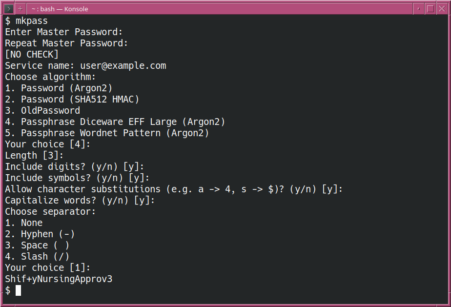
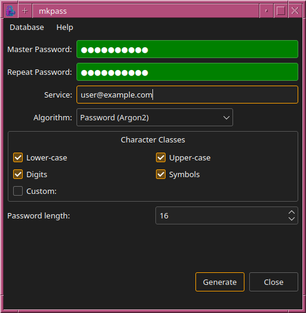
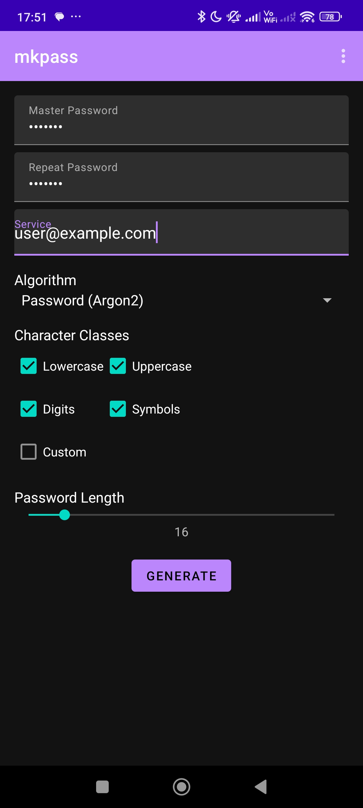
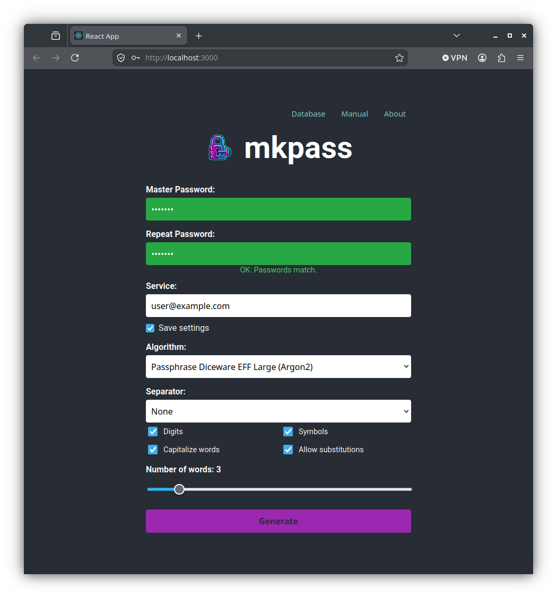

# mkpass

`mkpass` is a stateless, deterministic password and passphrase generator designed to eliminate the need for traditional password vaults and cloud synchronizations.

Instead of generating random passwords and saving them in an encrypted database or password manager, `mkpass` allows you to **re-generate** your passwords whenever and wherever you need them. You only need to remember a single **Master Password**. Combined with a service identifier (e.g. `github.com` or `email`) and reproducible parameters (such as password length or character classes), `mkpass` deterministically derives the exact same strong password every time using modern memory-hard cryptographic algorithms (Argon2id / HMAC-SHA512).

Service names and generation preferences are stored in a local SQLite database for convenient auto-completion and default suggestions. These parameters are non-secret configuration options—even without the database, as long as you know your master password and configuration options, your password can be generated on any device.

---

## Downloads & Releases

- **Latest Release**: [Download Latest Release](https://github.com/kgorelov/mkpass/releases/latest)
- **Release Notes & History**: [View Release Notes](https://github.com/kgorelov/mkpass/releases)

---

## Implementations & Applications

`mkpass` is available across multiple platforms to ensure you can access your passwords on any device.

### 1. Command-Line Interface (`mkpass`)

The terminal-based version offers an interactive interface as well as command-line flag and environment variable modes. It supports terminal-rendered QR codes for easily scanning passwords onto mobile devices.



### 2. Qt Graphical Interface (`mkpass-gui`)

A native desktop application built with Qt 5/6. Features include real-time service auto-completion, configurable character sets and passphrase options, database management modal, and automatic clipboard clearing upon window close for enhanced security.



### 3. Android Application

A mobile application bringing `mkpass` functionality to Android devices. Runs entirely offline on-device with zero network requirements and includes local database history for quick service selection.



### 4. Web Application (`mkpass_web`)

A client-side web application built with React, TypeScript, and WebAssembly (C++ compiled via Emscripten).

> [!IMPORTANT]
> **Security Guarantee**: The web version operates 100% client-side inside your web browser. No master passwords, service names, or derived passwords are ever transmitted over the network. All cryptographic hashing takes place in local WebAssembly execution memory.



---

## Key Features & Supported Algorithms

- **Argon2id (Modern Default)**: State-of-the-art key derivation algorithm resistant to GPU and ASIC brute-force attacks.
- **HMAC-SHA512**: Iterative SHA-512 derivation alternative.
- **Diceware Passphrases**: High-entropy passphrase generation using EFF Large Wordlist with optional word capitalization, separators, and symbol/digit insertion.
- **WordNet Pattern Passphrases**: Natural-sounding passphrase generation using grammatical structures (adjectives, nouns, verbs).
- **Local Service Database**: Saves non-secret preferences (algorithm, length, character sets) per service for fast workflow.
- **Terminal QR Code Generation**: Output derived passwords directly as QR codes in the terminal.
- **Security-First Design**: Memory sanitization and automatic clipboard wiping.

---

## Building from Source

### Prerequisites

- **C++ Compiler**: C++20 compliant compiler (GCC 10+, Clang 11+, MSVC 2019+)
- **CMake**: Version 3.20 or newer
- **Pixi** (Optional): Package manager for reproducible C++ toolchains
- **Qt 5 / Qt 6** (Required for GUI): `qtbase5-dev` or Qt6 development packages
- **Emscripten SDK** (Required for WebAssembly): `emsdk` for compiling C++ to WASM
- **Node.js & npm** (Required for Web Frontend): Node 18+
- **Android SDK & Gradle** (Required for Android App): Android Studio or command-line tools

---

### Building CLI and Qt GUI

#### Option A: Using CMake

```bash
# Clone the repository
git clone https://github.com/kgorelov/mkpass.git
cd mkpass

# Create build directory
mkdir build && cd build

# Configure (WITH_GUI=ON by default)
cmake -DCMAKE_BUILD_TYPE=Release -DWITH_GUI=ON ..

# Build executables
make -j$(nproc)
```

The resulting binaries will be placed in:
- `build/cli/mkpass` (Command-line tool)
- `build/gui/mkpass-gui` (Qt GUI application)

To build only the CLI without Qt dependencies:
```bash
cmake -DCMAKE_BUILD_TYPE=Release -DWITH_GUI=OFF ..
make -j$(nproc) mkpass
```

#### Option B: Using Pixi

```bash
# Build CLI & GUI
pixi run build-gui

# Build fully static CLI binary
pixi run cli-static

# Run test suite
pixi run test
```

#### Option C: Building Debian/Ubuntu (`.deb`) Packages

To build native `.deb` packages for Debian, Ubuntu, and Linux Mint:

```bash
# Install Debian build prerequisites
sudo apt-get install build-essential debhelper cmake qt6-base-dev libgtest-dev

# Build binary packages (without signing)
dpkg-buildpackage -us -uc -b
```

This will produce `mkpass_*.deb` (CLI utility) and `mkpass-gui_*.deb` (Qt GUI) packages in the parent directory (`../`).

To install the built packages:
```bash
sudo dpkg -i ../mkpass_*.deb ../mkpass-gui_*.deb
```

---

### Building the Web Application

1. **Compile C++ Core to WebAssembly**:
   ```bash
   # Make sure Emscripten environment is activated (emsdk_env.sh)
   ./build_wasm.sh
   ```
   This script compiles the WebAssembly module (`mkpass_webasm.js` and `mkpass_webasm.wasm`) and places it into `mkpass_web/public/`.

2. **Build and Run React Frontend**:
   ```bash
   cd mkpass_web
   npm install

   # Start local development server
   npm start

   # Build production static bundle
   npm run build
   ```

---

### Building the Android Application

```bash
cd android

# Build debug APK
./gradlew assembleDebug

# Build release APK
./gradlew assembleRelease
```
The compiled APK will be located in `android/app/build/outputs/apk/`.

---

## Documentation

Comprehensive user guides and documentation are available for each platform:

- **Command Line Man Page**: `man docs/man/mkpass.1`
- **Qt GUI Man Page**: `man docs/man/mkpass-gui.1`
- **Qt GUI User Manual**: Accessible via Help -> About / Help menu in `mkpass-gui` or [docs/qt_help.html](docs/qt_help.html)
- **Android User Manual**: Accessible via options menu in the Android app or [docs/android_help.html](docs/android_help.html)
- **Web Application Manual**: Accessible via online help or [docs/web_help.html](docs/web_help.html)

---

## License

Refer to `LICENSE` or project repository header for licensing details.
