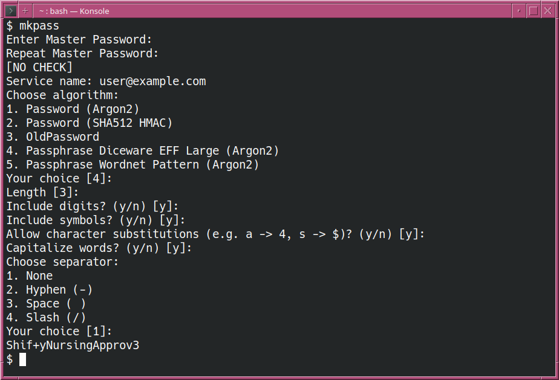
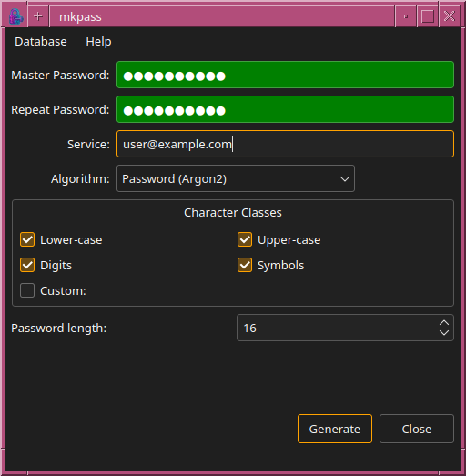
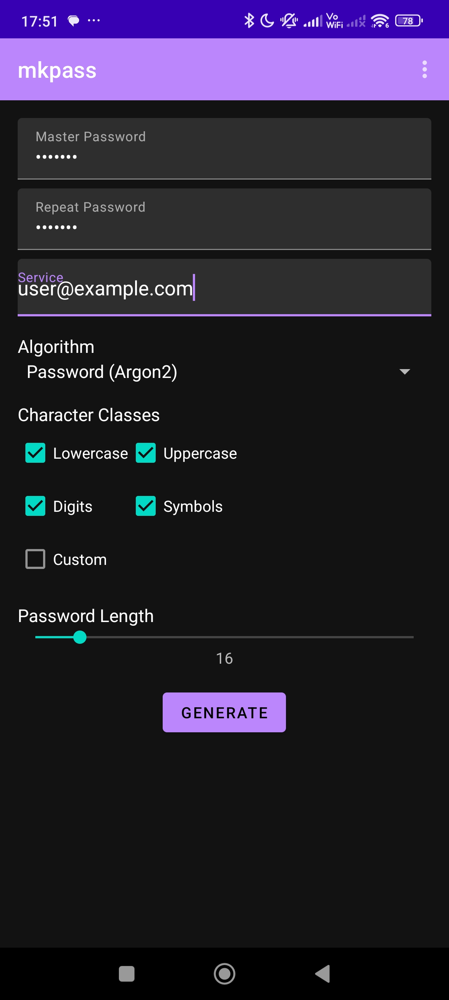
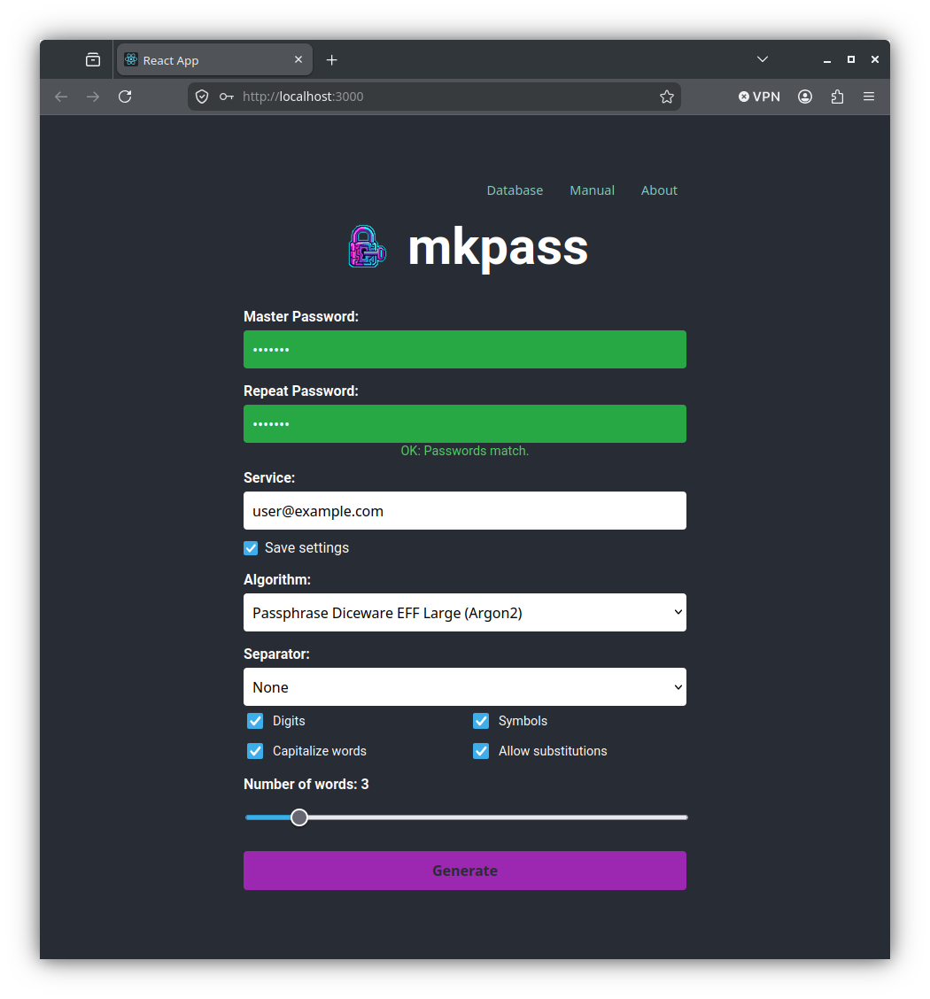

# mkpass

`mkpass` is a stateless, deterministic password and passphrase generator designed to eliminate the need for traditional password vaults and cloud synchronizations.

Instead of generating random passwords and saving them in an encrypted database or password manager, `mkpass` allows you to **re-generate** your passwords whenever and wherever you need them. You only need to remember a single **Master Password**. Combined with a service identifier (e.g. `github.com` or `email`) and reproducible parameters (such as password length or character classes), `mkpass` deterministically derives the exact same strong password every time using modern memory-hard cryptographic algorithms (Argon2id / HMAC-SHA512).

Service names and generation preferences are stored in a local SQLite database for convenient auto-completion and default suggestions. These parameters are non-secret configuration options—even without the database, as long as you know your master password and configuration options, your password can be generated on any device.

---

## Downloads & Distribution Packages

Pre-built binaries, native packages, and installers are published for every release on GitHub:

- **Latest Release**: [Download Latest Release](https://github.com/kgorelov/mkpass/releases/latest)
- **Release History & Notes**: [View All Releases](https://github.com/kgorelov/mkpass/releases)

### Available Release Deliverables:

| Platform | Format / Deliverable | Description | Installation / Execution |
|---|---|---|---|
| **Linux (Debian / Ubuntu / Mint)** | `.deb` package | Native Debian packages (`mkpass_*.deb`, `mkpass-gui_*.deb`) | `sudo dpkg -i mkpass*.deb` or double-click in GUI |
| **Linux (Fedora / RHEL / openSUSE)** | `.rpm` package | Native RPM packages (`mkpass-*.rpm`, `mkpass-gui-*.rpm`) | `sudo dnf install mkpass*.rpm` or `rpm -i` |
| **Linux (Universal)** | `.AppImage` | Self-contained executable with embedded Qt runtimes | `chmod +x mkpass*.AppImage && ./mkpass*.AppImage` |
| **Linux (Bundle)** | `.tar.gz` archive | Portable directory bundle with launcher script | Extract and run `./mkpass-gui` |
| **Linux (CLI Standalone)** | `.tar.gz` archive | Lightweight, mostly-static standalone CLI binary | Extract and place `mkpass` in your `PATH` |
| **Windows (10 / 11)** | `.exe` Setup Wizard | Inno Setup installer with Desktop/Start shortcuts & PATH registration | Run installer wizard |
| **Windows (Enterprise)** | `.msi` Windows Installer | WiX enterprise installer supporting silent GPO/Intune deployment | `msiexec /i mkpass-*.msi /qn` |
| **Windows (Portable)** | `.zip` archive | Standalone portable folder with Qt libraries and executables | Extract and run `mkpass-gui.exe` or `mkpass.exe` |
| **Android** | `.apk` package | Standalone offline mobile application | Install on Android device |
| **Web** | `.tar.gz` archive | Client-side React + WebAssembly distribution bundle | Deploy to static web server |
| **All Platforms** | `SHA512SUMS.txt` | Cryptographic SHA-512 checksums for all release assets | `sha512sum -c SHA512SUMS.txt` |

---

## Implementations & Applications

`mkpass` is available across multiple platforms to ensure you can access your passwords on any device.

### 1. Command-Line Interface (`mkpass`)

The terminal-based version offers interactive prompts, auto-completion, command-line flags, environment variables, user configuration management (`mkpass config`), and self-updating (`mkpass update`). It also renders terminal QR codes for scanning onto mobile devices.



### 2. Qt Graphical Interface (`mkpass-gui`)

A native desktop application built with Qt 5/6. Features include real-time service auto-completion, service comments, configurable character sets and passphrase options, database management modal, application preferences, integrated auto-updater, and automatic clipboard clearing upon window close.



### 3. Android Application

A mobile application bringing `mkpass` functionality to Android devices. Runs entirely offline on-device with zero network requirements and includes local database history for quick service selection.



### 4. Web Application (`mkpass_web`)

A client-side web application built with React, TypeScript, and WebAssembly (C++ compiled via Emscripten).

> [!IMPORTANT]
> **Security Guarantee**: The web version operates 100% client-side inside your web browser. No master passwords, service names, or derived passwords are ever transmitted over the network. All cryptographic hashing takes place in local WebAssembly execution memory.



---

## Key Features & Supported Algorithms

- **Argon2id (Modern Default)**: State-of-the-art key derivation algorithm resistant to GPU and ASIC brute-force attacks.
- **HMAC-SHA512**: Iterative SHA-512 derivation alternative.
- **Diceware Passphrases**: High-entropy passphrase generation using EFF Large Wordlist with optional word capitalization, separators, and symbol/digit insertion.
- **WordNet Pattern Passphrases**: Natural-sounding passphrase generation using grammatical structures (adjectives, nouns, verbs).
- **Service Comments**: Attach notes and descriptions to services in the local database.
- **Local Service Database**: Saves non-secret preferences (algorithm, length, character sets, comments) per service for fast workflow.
- **Terminal QR Code Generation**: Output derived passwords directly as QR codes in the terminal.
- **Security-First Design**: Memory sanitization and automatic clipboard wiping.

---

## Integrated Self-Updating System

`mkpass` includes a user-consented, privacy-preserving update mechanism across CLI and GUI.

### Privacy & Security Guarantees
- **Zero Telemetry**: No tracking identifiers, hardware IDs, passwords, or service names are sent. Only standard HTTP requests query the public GitHub Releases API.
- **Bandwidth Efficient**: Caches HTTP ETags in `~/.cache/mkpass/update_state.json` to receive `304 Not Modified` without consuming API rate limits.
- **Cryptographic Verification**: Automatically downloads `SHA512SUMS.txt` alongside releases, computes local SHA-512 digests, and aborts installation if a mismatch occurs.
- **Full User Control**: Update checks can be disabled at any time via configuration.

### CLI Update Subcommands
```bash
# Check if an update is available without downloading
mkpass update --check-only

# Check and prompt to install interactively
mkpass update

# Check and install without confirmation
mkpass update --yes
```

When background checks are enabled (`check_updates = true`), running regular generation commands will print a passive one-line notification to `stderr` if a newer version is known to exist:
```
[mkpass] Update available: v0.2.0 (current: v0.1.0). Run 'mkpass update' to install.
```

### GUI Update Checking
- **Background Checks**: Runs 4 seconds after startup if enabled in Preferences.
- **Manual Checks**: Select **Help &rarr; Check for Updates...** at any time.
- **Update Dialog**: Displays version comparison, formatted GitHub release changelog, options to skip releases, and a one-click download & install button.

---

## Configuration Management

Global defaults and settings are stored in `~/.config/mkpass/mkpass.conf` (TOML format) and managed via the `mkpass config` subcommand or GUI Preferences dialog.

```bash
# Get a configuration value
mkpass config get check_updates

# Set a configuration value
mkpass config set check_updates false
mkpass config set algorithm password/argon2
mkpass config set length 24

# Revert a configuration option to default
mkpass config unset check_updates

# Print active settings (or all settings including defaults)
mkpass config print
mkpass config print --all
```

### Supported Configuration Keys:
| Key | Type | Default | Description |
|---|---|---|---|
| `check_updates` | boolean | `true` | Enable periodic background checks for newer versions |
| `update_check_interval_days` | integer | `7` | Days between automatic update checks (1-365) |
| `update_channel` | string | `"stable"` | Update release channel (`"stable"` or `"prerelease"`) |
| `algorithm` | string | `password/argon2` | Default algorithm choice |
| `length` | integer | `16` | Default password length / passphrase word count |
| `char_classes` | string | `1234` | Default character sets (`lowercase,uppercase,digits,symbols`) |
| `custom_chars` | string | `""` | Default custom character pool |
| `separator` | string | `"-"` | Default passphrase word separator |
| `passphrase_pattern` | string | `"adj,noun,verb"` | Default WordNet grammatical pattern |
| `digits` | boolean | `false` | Default digits inclusion for passphrases |
| `symbols` | boolean | `false` | Default symbols inclusion for passphrases |
| `substitutions` | boolean | `false` | Default leetspeak substitution flag for passphrases |
| `capitalize` | boolean | `false` | Default word capitalization flag for passphrases |
| `enable_old_algorithm` | boolean | `false` | Enable deprecated legacy algorithm 3 |

---

## Building from Source

### Prerequisites

- **C++ Compiler**: C++20 compliant compiler (GCC 10+, Clang 11+, MSVC 2019+)
- **CMake**: Version 3.20 or newer
- **Pixi** (Optional): Package manager for reproducible C++ toolchains
- **Qt 5 / Qt 6** (Required for GUI): `qtbase5-dev` or Qt6 development packages
- **Emscripten SDK** (Required for WebAssembly): `emsdk` for compiling C++ to WASM
- **Node.js & npm** (Required for Web Frontend): Node 18+
- **Android SDK & Gradle** (Required for Android App): Android Studio or command-line tools

---

### Building CLI and Qt GUI

#### Option A: Using CMake

```bash
# Clone the repository
git clone https://github.com/kgorelov/mkpass.git
cd mkpass

# Create build directory
mkdir build && cd build

# Configure (WITH_GUI=ON by default)
cmake -DCMAKE_BUILD_TYPE=Release -DWITH_GUI=ON ..

# Build executables
make -j$(nproc)
```

The resulting binaries will be placed in:
- `build/cli/mkpass` (Command-line tool)
- `build/gui/mkpass-gui` (Qt GUI application)

To build only the CLI without Qt dependencies:
```bash
cmake -DCMAKE_BUILD_TYPE=Release -DWITH_GUI=OFF ..
make -j$(nproc) mkpass
```

#### Option B: Using Pixi

```bash
# Build CLI & GUI
pixi run build-gui

# Build fully static CLI binary
pixi run cli-static

# Run test suite
pixi run test
```

#### Option C: Packaging Native Linux Packages (.deb & .rpm)

Use the unified packaging script to generate `.deb` and `.rpm` packages in `dist/`:

```bash
# Build Debian packages (.deb) and RPM packages (.rpm)
./scripts/package_linux.sh
```

Or build Debian packages directly:
```bash
dpkg-buildpackage -us -uc -b
```

Or build RPM packages via rpmbuild:
```bash
rpmbuild -bb packaging/rpm/mkpass.spec
```

#### Option D: Packaging Windows Installers (.exe & .msi)

On Windows runners with Inno Setup and WiX Toolset:
```powershell
bash scripts/package_windows.sh
```
This generates the Inno Setup installer (`mkpass-*-windows-x64-setup.exe`), WiX MSI (`mkpass-*-windows-x64.msi`), and portable zip (`mkpass-*-windows-x64.zip`) in `dist/`.

---

### Building the Web Application

1. **Compile C++ Core to WebAssembly**:
   ```bash
   ./build_wasm.sh
   ```
   This script compiles the WebAssembly module (`mkpass_webasm.js` and `mkpass_webasm.wasm`) and places it into `mkpass_web/public/`.

2. **Build and Run React Frontend**:
   ```bash
   cd mkpass_web
   npm install

   # Start local development server
   npm start

   # Build production static bundle
   npm run build
   ```

---

### Building the Android Application

```bash
cd android

# Build debug APK
./gradlew assembleDebug

# Build release APK
./gradlew assembleRelease
```
The compiled APK will be located in `android/app/build/outputs/apk/`.

---

## Documentation

Comprehensive user guides and documentation are available for each platform:

- **Command Line Man Page**: `man docs/man/mkpass.1`
- **Qt GUI Man Page**: `man docs/man/mkpass-gui.1`
- **Qt GUI User Manual**: Accessible via Help -> About / Help menu in `mkpass-gui` or [docs/qt_help.html](docs/qt_help.html)
- **Android User Manual**: Accessible via options menu in the Android app or [docs/android_help.html](docs/android_help.html)
- **Web Application Manual**: Accessible via online help or [docs/web_help.html](docs/web_help.html)

---

## License

Refer to `LICENSE` or project repository header for licensing details.
