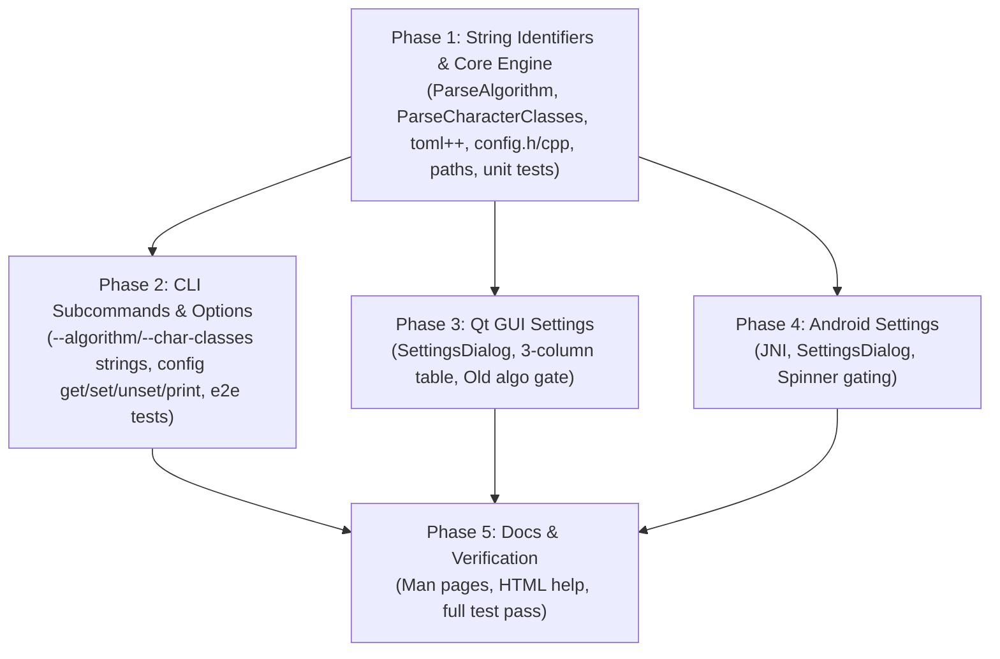

# Technical Implementation Plan: mkpass Configuration System

This document outlines the detailed technical implementation plan for introducing persistent user configuration to `mkpass`, based on the requirements defined in [`mkpass_config_idea.md`](file:///home/kgorelov/git/mkpass/docs/mkpass_config_idea.md) and subsequent architectural refinements for human-readable string identifiers.

---

## 1. Executive Summary & Goals

`mkpass` is a deterministic, stateless password generator. Currently, persistent user choices exist only per-service within a local SQLite database (`~/.mkpass.db`). For new services or one-off executions, default values are hardcoded in source code or temporarily overridden via environment variables and CLI arguments.

### Objectives:
1. **Persistent Configuration**: Provide a user configuration file in TOML format at `~/.config/mkpass/mkpass.conf` to store custom default options across all invocations.
2. **Environment Variable Alignment**: Mirror all existing generator configuration environment variables (excluding `password` and `service` for security and statelessness) as persistent configuration options.
3. **Human-Readable String Identifiers**: Replace error-prone numeric IDs (`1`..`5`, `"1234"`) for algorithms and character classes across CLI flags, environment variables, and config files with intuitive, self-documenting strings (e.g. `--algorithm password/argon2`, `--char-classes uppercase,lowercase,digits,symbols`). Maintain backward compatibility for existing numeric inputs.
4. **CLI Configuration Management**: Implement a git-like CLI command suite:
   - `mkpass config get <key>`
   - `mkpass config set <key> <value>`
   - `mkpass config unset <key>`
   - `mkpass config print`
5. **Desktop GUI Settings Dialog**: Add a "Settings" / "Preferences" dialog to `mkpass-gui` featuring a 3-column table (Enable Tickbox, Variable Name, Variable Value) with disabled items styled in grey.
6. **Android Settings Dialog**: Add a corresponding "Settings" dialog to the Android application with equivalent 3-column table capabilities.
7. **Deprecate & Guard "Old Algorithm"**: Hide the legacy algorithm (`Algorithm::Old`) by default across CLI, GUI, and Android interfaces. Only display it if explicitly enabled via `enable_old_algorithm` (config or env) or when maintaining an existing service record that already uses it. Prohibit creating new services with the old algorithm when it is disabled.

---

## 2. Configuration Schema & Variables

### 2.1 Option Definitions

All supported options, their types, allowed values, and built-in fallbacks are specified below:

| Option Key | TOML Type | CLI / Env Equivalent | Canonical String Values | Built-in Default | Description |
|---|---|---|---|---|---|
| `algorithm` | string | `-a`, `--algorithm`<br>`MKPASS_ALGORITHM` | `"password/argon2"`<br>`"password/sha512"`<br>`"passphrase/diceware"`<br>`"passphrase/wordnet"`<br>`"password/old"` | `"password/argon2"` | Default password or passphrase derivation algorithm |
| `char_classes` | string | `-c`, `--char-classes`<br>`MKPASS_CHAR_CLASSES` | Comma-separated: `"lowercase"`, `"uppercase"`, `"digits"`, `"symbols"`, or `"custom"` | `"lowercase,uppercase,digits,symbols"` | Character classes enabled for password generation |
| `custom_chars` | string | `--custom-chars`<br>`MKPASS_CUSTOM_CHARS` | Any UTF-8 / ASCII string | `""` | Custom characters included when `custom` character class is selected |
| `length` | integer | `-l`, `--length`<br>`MKPASS_LENGTH` | `1`..`128` (password) or `1`..`20` (passphrase) | `16` (pwd)<br>`3` (passphrase)<br>`8` (old) | Default password length or passphrase word count |
| `separator` | string | `--separator`<br>`MKPASS_SEPARATOR` | Any string (`""`, `"-"`, `" "`, `"/"`, etc.) | `""` (None) | Word separator for passphrase generation |
| `passphrase_pattern` | string | `--pattern`<br>`MKPASS_PASSPHRASE_PATTERN` | Pattern letters (`"navrn"`), index (`"1"`..), or `""` (random) | `""` (Random) | WordNet grammatical part-of-speech pattern |
| `digits` | boolean | `--digits`<br>`MKPASS_DIGITS` | `true`, `false` (`y`/`n`, `1`/`0`) | `false` | Include digits in passphrases |
| `symbols` | boolean | `--symbols`<br>`MKPASS_SYMBOLS` | `true`, `false` (`y`/`n`, `1`/`0`) | `false` | Include symbols in passphrases |
| `substitutions` | boolean | `--substitutions`<br>`MKPASS_SUBSTITUTIONS` | `true`, `false` (`y`/`n`, `1`/`0`) | `false` | Allow leet substitutions in passphrases |
| `capitalize` | boolean | `--capitalize`<br>`MKPASS_CAPITALIZE` | `true`, `false` (`y`/`n`, `1`/`0`) | `true` | Capitalize words in passphrases |
| `enable_old_algorithm` | boolean | `MKPASS_ENABLE_OLD_ALGORITHM`<br>`enable_old_algorithm` | `true`, `false` (`y`/`n`, `1`/`0`) | `false` | Enable display and creation of legacy "OldPassword" algorithm |

### 2.2 Security Exclusion Policy
`password` and `service` are explicitly excluded from configuration storage:
- Storing master passwords on disk violates `mkpass` core security model (zero stored secrets).
- Storing a default service name would encourage password reuse and defeat deterministic domain separation.

---

## 3. Human-Readable String Identifiers Specification

### 3.1 Motivation
Relying on arbitrary integer indices (`1`..`5`) or packed digit strings (`"1234"`) has several severe drawbacks:
1. **High Error Rate**: Users and scripts easily confuse algorithm numbers (e.g., `4` vs `5` for Diceware vs WordNet).
2. **Poor Maintainability**: Adding new algorithms or deprecating existing ones alters numeric indexes or creates non-contiguous mappings.
3. **Configuration Clarity**: A config file containing `algorithm = 1` and `char_classes = "1234"` is opaque; `algorithm = "password/argon2"` and `char_classes = "lowercase,uppercase,digits,symbols"` is completely self-documenting.

### 3.2 Algorithm String Specification
The canonical algorithm identifiers follow a hierarchical `category/variant` naming scheme:

| Enum Value | Canonical Identifier | Accepted Aliases / Legacy Values |
|---|---|---|
| `Algorithm::Argon2` | `"password/argon2"` | `"argon2"`, `"1"` |
| `Algorithm::SlowSha512` | `"password/sha512"` | `"sha512"`, `"2"` |
| `Algorithm::Old` | `"password/old"` | `"old"`, `"3"` |
| `Algorithm::Passphrase_Diceware_EFF_Large` | `"passphrase/diceware"` | `"diceware"`, `"4"` |
| `Algorithm::Passphrase_Wordnet_Pattern` | `"passphrase/wordnet"` | `"wordnet"`, `"5"` |

- Parsing is **case-insensitive** (e.g. `"Password/Argon2"` is treated as `"password/argon2"`).
- In serialized config files and `mkpass config get algorithm`, the canonical full string (`"password/argon2"`) is always emitted.

### 3.3 Character Classes String Specification
Character classes are specified as a comma-separated list of descriptive tokens:

| Enum Value | Canonical Token | Accepted Aliases / Legacy Digit |
|---|---|---|
| `CharacterClass::LOWERCASE` | `"lowercase"` | `"lower"`, `'1'` |
| `CharacterClass::UPPERCASE` | `"uppercase"` | `"upper"`, `'2'` |
| `CharacterClass::DIGITS` | `"digits"` | `"digit"`, `'3'` |
| `CharacterClass::SYMBOLS` | `"symbols"` | `"symbol"`, `'4'` |
| `CharacterClass::CUSTOM` | `"custom"` | `'5'` |

#### Examples:
- Full standard set: `"lowercase,uppercase,digits,symbols"`
- Uppercase and digits only: `"uppercase,digits"`
- Custom characters: `"custom"`
- Permissive parsing: Spaces around commas are ignored (`"lowercase, uppercase, digits"`), tokens are case-insensitive, and legacy numeric strings (`"1234"`, `"12345"`) remain valid for backward compatibility.

### 3.4 Core Library Conversion Functions
Add dedicated helper functions in [`libmkpass/algorithms.h`](file:///home/kgorelov/git/mkpass/libmkpass/algorithms.h) and [`libmkpass/character_classes.h`](file:///home/kgorelov/git/mkpass/libmkpass/character_classes.h):

```cpp
// algorithms.h
std::string AlgorithmToIdentifier(Algorithm algo);
std::optional<Algorithm> ParseAlgorithm(const std::string& str);

// character_classes.h
std::string CharacterClassesToIdentifierString(const std::vector<CharacterClass>& classes);
std::vector<CharacterClass> ParseCharacterClasses(const std::string& str);
```

---

## 4. Precedence Hierarchy

When determining the effective parameter value during password generation, the following hierarchy applies (highest priority first):

1. **Explicit CLI Options** (e.g., `-l 24`, `-a password/argon2`, `-c uppercase,digits`)
2. **Environment Variables** (e.g., `MKPASS_LENGTH=24`, `MKPASS_ALGORITHM="password/argon2"`)
3. **Database Entry** (if `--service` matches a record previously saved in SQLite `~/.mkpass.db`)
4. **User Configuration File** (`~/.config/mkpass/mkpass.conf`)
5. **Application Built-in Defaults** (e.g., length `16`, algorithm `password/argon2`, char classes `lowercase,uppercase,digits,symbols`)

*Note*: For the legacy algorithm gate (`enable_old_algorithm`), CLI flag/Env/Config grants global visibility. If global visibility is `false`, the legacy algorithm is only exposed if the matched database record already uses `Algorithm::Old`.

---

## 5. Architecture & Component Design

```
+-------------------------------------------------------------------------+
|                              Frontends                                  |
|   +-------------------+  +-------------------+  +-------------------+   |
|   |  CLI Application  |  |   Qt Desktop GUI  |  |    Android App    |   |
|   | (cli/cli.cpp)     |  | (gui/gui.cpp)     |  | (MainActivity)   |   |
|   |  mkpass config    |  |  Settings Dialog  |  |  Settings Dialog  |   |
|   +---------+---------+  +---------+---------+  +---------+---------+   |
+-------------|----------------------|----------------------|-------------+
              |                      |                      | JNI
+-------------v----------------------v----------------------v-------------+
|                          libmkpass Core                                 |
|                                                                         |
|   +-----------------------------------------------------------------+   |
|   |                     mkpass::Config Engine                       |   |
|   |   - Load / Save TOML (~/.config/mkpass/mkpass.conf)             |   |
|   |   - Human-readable string conversions (ParseAlgorithm, etc.)   |   |
|   |   - Typed Getters / Setters                                     |   |
|   |   - Raw String Interface (get_raw, set_raw, unset_raw, print)   |   |
|   |   - Validation & Conversion                                     |   |
|   +--------------------------------+--------------------------------+   |
|                                    |                                    |
|   +--------------------------------v--------------------------------+   |
|   |               Vendored toml++ (Single Header)                   |   |
|   |               (libmkpass/toml.hpp)                              |   |
|   +-----------------------------------------------------------------+   |
+-------------------------------------------------------------------------+
```

---

## 6. Core Engine Implementation (`libmkpass`)

### 6.1 TOML Engine: `toml++`
Vendor the single-header TOML parser to preserve zero-dependency and cross-platform portability:
- Location: `libmkpass/toml.hpp` (from `tomlplusplus` v3.4+, MIT License).
- Modern C++20 compliant, zero third-party dependencies, conforms to TOML 1.0.

### 6.2 Path Resolution & Platform Utilities
Add `GetConfigFilePath()` to [`libmkpass/platform_utils.h`](file:///home/kgorelov/git/mkpass/libmkpass/platform_utils.h):
- **Environment Override**: Check `MKPASS_CONFIG_PATH`. If defined, use it directly (critical for hermetic unit and E2E tests).
- **POSIX** ([`libmkpass/posix_ext.h`](file:///home/kgorelov/git/mkpass/libmkpass/posix_ext.h)):
  - If `$XDG_CONFIG_HOME` is set: `$XDG_CONFIG_HOME/mkpass/mkpass.conf`
  - Otherwise: `wordexp("~/.config/mkpass/mkpass.conf")`
- **Windows** ([`libmkpass/win32_ext.h`](file:///home/kgorelov/git/mkpass/libmkpass/win32_ext.h)):
  - Use `SHGetKnownFolderPath(FOLDERID_RoamingAppData)` -> `%APPDATA%\mkpass\mkpass.conf`
- **Directory Creation**:
  - Automatically create parent directories with `std::filesystem::create_directories()` when saving.

### 6.3 Config Data Structures & Class Interface
Create `libmkpass/config.h` and `libmkpass/config.cpp`:

```cpp
namespace mkpass {

struct ConfigOptions {
    std::optional<Algorithm> algorithm;
    std::optional<std::vector<CharacterClass>> char_classes;
    std::optional<std::string> custom_chars;
    std::optional<size_t> length;
    std::optional<std::string> separator;
    std::optional<std::vector<WordClasses>> passphrase_pattern;
    std::optional<bool> digits;
    std::optional<bool> symbols;
    std::optional<bool> substitutions;
    std::optional<bool> capitalize;
    std::optional<bool> enable_old_algorithm;
};

class Config {
public:
    explicit Config(std::string file_path = "");

    bool load();
    bool save();

    // Key-value inspection for CLI and Settings UI
    std::optional<std::string> get_raw(const std::string& key) const;
    void set_raw(const std::string& key, const std::string& value);
    bool unset_raw(const std::string& key);
    bool is_set(const std::string& key) const;
    std::string print() const;

    // Strongly-typed access
    const ConfigOptions& options() const { return options_; }
    void set_options(const ConfigOptions& opts);

    const std::string& path() const { return path_; }
    bool exists() const;

    // Helpers
    static std::string get_default_config_path();
    static bool is_valid_key(const std::string& key);
    static std::vector<std::string> get_all_keys();
    static std::string get_built_in_default(const std::string& key);

private:
    std::string path_;
    ConfigOptions options_;
    void parse_toml(const std::string& content);
    std::string serialize_toml() const;
};

// Global helper for checking legacy algorithm authorization
bool IsOldAlgorithmEnabled(const Config& config);

} // namespace mkpass
```

### 6.4 Sample TOML Configuration
When serialized to `~/.config/mkpass/mkpass.conf`:
```toml
# mkpass configuration file
# All options represent user defaults. Unset options fall back to application defaults.

algorithm = "password/argon2"
char_classes = "lowercase,uppercase,digits,symbols"
length = 16
custom_chars = ""
separator = "-"
passphrase_pattern = ""
digits = false
symbols = false
substitutions = false
capitalize = true
enable_old_algorithm = false
```

### 6.5 Build System Integration
Update build files to include `config.cpp`:
- [`libmkpass/CMakeLists.txt`](file:///home/kgorelov/git/mkpass/libmkpass/CMakeLists.txt): Add `config.cpp` to `SOURCES`.
- [`android/app/src/main/cpp/CMakeLists.txt`](file:///home/kgorelov/git/mkpass/android/app/src/main/cpp/CMakeLists.txt): Add `config.cpp` to `CPP_SOURCES`.

---

## 7. Command-Line Interface (`cli`)

### 7.1 Human-Readable Option Upgrades
Update CLI11 options in [`cli/cli.cpp`](file:///home/kgorelov/git/mkpass/cli/cli.cpp):
- `-a, --algorithm`: Accepts string values (`password/argon2`, `password/sha512`, `passphrase/diceware`, `passphrase/wordnet`, `password/old`) or legacy numbers (`1`..`5`).
- `-c, --char-classes`: Accepts comma-separated string list (`lowercase,uppercase,digits,symbols` or `custom`) or legacy numbers (`1234`).
- Corresponding environment variables `MKPASS_ALGORITHM` and `MKPASS_CHAR_CLASSES` consume the same string values.

### 7.2 Subcommand Suite
Integrate CLI11 subcommands:
```
mkpass config get <key>
mkpass config set <key> <value>
mkpass config unset <key>
mkpass config print
```

#### Examples:
```bash
# Setting human-readable algorithm and char classes
mkpass config set algorithm password/argon2
mkpass config set char_classes lowercase,uppercase,digits,symbols

# Inspecting values
mkpass config get algorithm
# Output: password/argon2

mkpass config get char_classes
# Output: lowercase,uppercase,digits,symbols

# Printing configuration
mkpass config print

# Unsetting a value
mkpass config unset separator
```

#### Behavior & Exit Codes:
- `mkpass config get <key>`:
  - If `<key>` is invalid: output error to `std::cerr`, exit code `1`.
  - If `<key>` is valid but unset: output error to `std::cerr`, exit code `1`.
  - If `<key>` is present: print value to `std::cout`, exit code `0`.
- `mkpass config set <key> <value>`:
  - Validates `<key>` and `<value>` (validates algorithm string, char classes tokens, integer bounds, booleans).
  - Exit code `0` on success, `1` on error.
- `mkpass config unset <key>`:
  - Removes entry and writes to disk; exit code `0`.
- `mkpass config print [-a, --all]`:
  - Prints raw TOML content to `std::cout`; exit code `0`. When `-a` or `--all` is specified, prints all supported configuration options including their default values.

### 7.3 Generator Precedence Integration
In `run_cli()`:
1. Initialize `mkpass::Config cfg(GetConfigFilePath()); cfg.load();`.
2. When parsing CLI/Env, if an option is not set via CLI or Env:
   - For algorithm: `Algorithm default_algo = known ? db_entry->algorithm : cfg.options().algorithm.value_or(Algorithm::Argon2);`
   - For password length: `cfg.options().length.value_or(16)`
   - For character classes: `cfg.options().char_classes.value_or(...)`
   - For passphrase settings: `cfg.options().separator`, `cfg.options().digits`, etc.

### 7.4 Legacy Algorithm Enforcement
1. Check if `Algorithm::Old` is globally active:
   ```cpp
   bool old_enabled = cfg.options().enable_old_algorithm.value_or(false);
   if (const char* env1 = std::getenv("MKPASS_ENABLE_OLD_ALGORITHM")) {
       old_enabled = (std::string(env1) == "1" || std::string(env1) == "true");
   } else if (const char* env2 = std::getenv("enable_old_algorithm")) {
       old_enabled = (std::string(env2) == "1" || std::string(env2) == "true");
   }
   ```
2. In `AskForAlgorithm()`:
   - If `!old_enabled && (!known || db_entry->algorithm != Algorithm::Old)`:
     Omit `OldPassword` from the displayed interactive choices.
3. If user attempts to create a new service with `-a password/old` (or `-a 3`) while `!old_enabled`:
   - Throw `std::runtime_error("Legacy algorithm 'password/old' is disabled. Set 'enable_old_algorithm = true' in config or environment to enable.")`.

---

## 8. Qt Desktop GUI (`gui`)

### 8.1 Menu Bar & Settings Action
In [`gui/gui.cpp`](file:///home/kgorelov/git/mkpass/gui/gui.cpp):
- Add a new menu:
  ```cpp
  QMenu *settingsMenu = menuBar->addMenu("Settings");
  QAction *preferencesAction = settingsMenu->addAction("Preferences...");
  preferencesAction->setShortcut(QKeySequence::Preferences);
  connect(preferencesAction, &QAction::triggered, this, &MainWindow::showSettings);
  ```

### 8.2 Settings Dialog UI (`SettingsDialog`)
Implement `gui/settings_dialog.h` and `gui/settings_dialog.cpp`:
- Modal `QDialog` containing a `QScrollArea` with distinct visual group boxes (`QGroupBox`):
  1. **General**:
     - `algorithm`: `QComboBox` showing display names mapped to canonical strings (`password/argon2`, `password/sha512`, `passphrase/diceware`, `passphrase/wordnet`, and `password/old` if enabled).
     - `length`: `QSpinBox` (range `1`..`128`).
     - `enable_old_algorithm`: `QComboBox` (`true`, `false`).
  2. **Password Options**:
     - `char_classes`: Checkbox group widget (`Lower-case`, `Upper-case`, `Digits`, `Symbols`, `Custom`).
     - `custom_chars`: `QLineEdit` for custom character sets.
  3. **Passphrase Options**:
     - `separator`: `QComboBox` (`None`, `Hyphen (-)`, `Space ( )`, `Slash (/ )`).
     - `passphrase_pattern`: Editable `QComboBox` with `Random` and all standard natural patterns with descriptions (e.g. `van (Verb, Adj, Noun)`), allowing custom pattern input.
     - `digits`, `symbols`, `substitutions`, `capitalize`: `QComboBox` (`true`, `false`).
- Each group box embeds a 3-column table (`QTableWidget`) with auto-sized height:
  1. **Column 0: Enabled (Tickbox)**
     - `QTableWidgetItem` with `Qt::ItemIsUserCheckable`.
     - Checked: row text color is normal (`QPalette::Text`), value editor is enabled.
     - Unchecked: row text color is grey (`Qt::gray`), value editor is disabled (`setEnabled(false)`).
  2. **Column 1: Variable Name**
     - Non-editable text displaying option name (`algorithm`, `char_classes`, `length`, etc.).
  3. **Column 2: Default Value**
     - Form editors for option configuration.
- **Dialog Controls**:
  - `Save` Button: Writes enabled entries to `~/.config/mkpass/mkpass.conf` and unsets disabled ones. Notifies `MainWindow`.
  - `Cancel` Button: Discards uncommitted modifications.
  - `Restore Defaults` Button: Sets all fields to application defaults.

### 8.3 Dynamic Legacy Algorithm Gating in Qt GUI
In [`gui/gui.cpp`](file:///home/kgorelov/git/mkpass/gui/gui.cpp):
1. Create `updateAlgorithmComboBox(bool force_include_old = false)`:
   - Check if `enable_old_algorithm` is active in `Config` or environment.
   - If active or `force_include_old == true`: populate `algorithmComboBox` with all 5 algorithms.
   - Otherwise: populate `algorithmComboBox` with only the 4 modern algorithms (omit `Algorithm::Old`).
2. In `serviceChanged(const QString &service)`:
   - Check if `service` exists in DB.
   - If record exists and `entry->algorithm == Algorithm::Old`:
     Call `updateAlgorithmComboBox(true)` and select `Algorithm::Old`.
   - If record does not exist or uses a modern algorithm:
     Call `updateAlgorithmComboBox(false)` to ensure `Algorithm::Old` cannot be picked for new services.

---

## 9. Android Application (`android`)

### 9.1 JNI Layer (`native-lib.cpp`)
Extend [`android/app/src/main/cpp/native-lib.cpp`](file:///home/kgorelov/git/mkpass/android/app/src/main/cpp/native-lib.cpp):
- Maintain a global `std::unique_ptr<mkpass::Config> config;`.
- Add JNI functions:
  ```cpp
  void Java_app_mkpass_MainActivity_initConfig(JNIEnv *env, jobject thiz, jstring configPath);
  jstring Java_app_mkpass_MainActivity_getConfigValue(JNIEnv *env, jobject thiz, jstring key);
  void Java_app_mkpass_MainActivity_setConfigValue(JNIEnv *env, jobject thiz, jstring key, jstring val);
  void Java_app_mkpass_MainActivity_unsetConfigValue(JNIEnv *env, jobject thiz, jstring key);
  jboolean Java_app_mkpass_MainActivity_isConfigKeySet(JNIEnv *env, jobject thiz, jstring key);
  jboolean Java_app_mkpass_MainActivity_isOldAlgorithmEnabled(JNIEnv *env, jobject thiz);
  ```

### 9.2 Menu Integration
In [`android/app/src/main/res/menu/main_menu.xml`](file:///home/kgorelov/git/mkpass/android/app/src/main/res/menu/main_menu.xml):
- Add `menu_settings`:
  ```xml
  <item
      android:id="@+id/menu_settings"
      android:title="Settings"
      app:showAsAction="never" />
  ```

### 9.3 Settings Dialog UI
Create layout `dialog_settings.xml` and row item layout `item_setting_record.xml`:
- **Row Structure**:
  - `CheckBox` (`settingEnabled`): Toggles setting active/inactive.
  - `TextView` (`settingName`): Name of the variable.
  - `TextView` (`settingValue`): Human-readable string value.
- **Visual State**:
  - Disabled state: `settingName` and `settingValue` text color set to `#888888` (grey); click listeners disabled.
  - Enabled state: standard text colors; clicking value opens an input editor (Dialog with Spinner, MultiSelect, or NumberPicker).
- **Dialog Actions**:
  - `Save`: Persists configuration through JNI and triggers `MainActivity` defaults refresh.
  - `Cancel`: Discards uncommitted modifications.

### 9.4 Android Algorithm Spinner Gating
In [`android/app/src/main/java/app/mkpass/MainActivity.java`](file:///home/kgorelov/git/mkpass/android/app/src/main/java/app/mkpass/MainActivity.java):
1. Make `ALGORITHMS` array dynamic via `List<AlgorithmItem>` mapping display name to canonical string / Algorithm ID.
2. If `isOldAlgorithmEnabled()` is false:
   - Exclude "OldPassword" from `algorithmSpinner`.
3. In `loadServiceEntry(String serviceName)`:
   - If service entry uses `Algorithm::Old`: dynamically inject "OldPassword" into the spinner adapter and select it.
   - If moving to a new or modern service: remove "OldPassword" from the adapter if `!isOldAlgorithmEnabled()`.

---

## 10. Testing Strategy

### 10.1 String Parsing & Core Unit Tests (`libmkpass/config_ut.cpp`)
Add a new test suite to [`libmkpass/CMakeLists.txt`](file:///home/kgorelov/git/mkpass/libmkpass/CMakeLists.txt):
1. **AlgorithmStringParsing**: Test `ParseAlgorithm("password/argon2")`, `"passphrase/diceware"`, `"wordnet"`, case-insensitivity, and fallback for legacy `"1"`..`"5"`. Verify invalid strings return `std::nullopt`.
2. **CharClassesStringParsing**: Test `ParseCharacterClasses("lowercase,uppercase,digits,symbols")`, `"uppercase,digits"`, `"custom"`, whitespace trimming, and legacy `"1234"` fallback.
3. **ConfigParsing & Serialization**: Verify saving and reloading TOML containing human-readable string values produces identical state.
4. **GetSetUnset**: Verify `set_raw("algorithm", "password/argon2")`, `get_raw("algorithm")`, `unset_raw()`, and validation errors on bogus values.
5. **OldAlgorithmFlag**: Test detection of `enable_old_algorithm` across config options and environment variables.

### 10.2 CLI End-to-End Tests (`cli/e2e_test.cpp`)
Extend [`cli/e2e_test.cpp`](file:///home/kgorelov/git/mkpass/cli/e2e_test.cpp) using a temporary `MKPASS_CONFIG_PATH`:
1. `mkpass config set algorithm password/argon2` -> verify `mkpass config get algorithm` outputs `password/argon2`.
2. `mkpass config set char_classes lowercase,uppercase,digits,symbols` -> verify `mkpass config get char_classes` outputs `lowercase,uppercase,digits,symbols`.
3. Test CLI flags: `mkpass --algorithm password/sha512 -s test -d -d` and `mkpass --char-classes digits,symbols -s test -d -d`.
4. Test environment variables: `MKPASS_ALGORITHM="passphrase/diceware"` and `MKPASS_CHAR_CLASSES="lowercase,digits"`.
5. **Old Algorithm Gating Test**:
   - Run without `enable_old_algorithm` -> verify `OldPassword` is omitted from choices.
   - Run `mkpass -a password/old` for a new service -> verify command fails with descriptive error.
   - Set `mkpass config set enable_old_algorithm true` -> verify `mkpass -a password/old` succeeds.
   - Verify existing DB record with `Algorithm::Old` works even when `enable_old_algorithm` is false.

---

## 11. Documentation Updates

1. **[`docs/man/mkpass.1`](file:///home/kgorelov/git/mkpass/docs/man/mkpass.1)**:
   - Update `--algorithm` documentation with canonical string values (`password/argon2`, `password/sha512`, `passphrase/diceware`, `passphrase/wordnet`).
   - Update `--char-classes` with comma-separated format (`lowercase,uppercase,digits,symbols`, `custom`).
   - Document `mkpass config` subcommands (`get`, `set`, `unset`, `print`).
   - Document `~/.config/mkpass/mkpass.conf` and `MKPASS_CONFIG_PATH`.
   - Document `MKPASS_ENABLE_OLD_ALGORITHM` / `enable_old_algorithm` and algorithm deprecation policy.
2. **[`docs/man/mkpass-gui.1`](file:///home/kgorelov/git/mkpass/docs/man/mkpass-gui.1)**:
   - Document the Settings/Preferences dialog under `Settings` menu.
3. **[`docs/qt_help.html`](file:///home/kgorelov/git/mkpass/docs/qt_help.html)** & **[`docs/android_help.html`](file:///home/kgorelov/git/mkpass/docs/android_help.html)**:
   - Add a dedicated "Configuring Defaults & Settings" section with descriptions of the 3-column table and human-readable option values.
4. **[`README.md`](file:///home/kgorelov/git/mkpass/README.md)**:
   - Update CLI option examples and configuration instructions.

---

## 12. Work Breakdown Structure & Milestones



- **Phase 1: String Identifiers & Core Configuration Engine (`libmkpass`)**
  - Implement `AlgorithmToIdentifier` & `ParseAlgorithm` in `algorithms.h`/`algorithms.cpp`.
  - Implement `CharacterClassesToIdentifierString` & `ParseCharacterClasses` in `character_classes.h`/`character_classes.cpp`.
  - Vendor `toml++` into `libmkpass/toml.hpp`.
  - Implement path resolution in `platform_utils.h` (`posix_ext.h`, `win32_ext.h`).
  - Implement `mkpass::Config` and `ConfigOptions` in `libmkpass/config.h` & `libmkpass/config.cpp`.
  - Add and pass unit tests in `libmkpass/config_ut.cpp`.
- **Phase 2: CLI Subcommands & Option Upgrades (`cli`)**
  - Update CLI option parsing in `cli/cli.cpp` to parse human-readable algorithm and char-classes strings.
  - Integrate `config` subcommand into `cli/cli.cpp` with `get`, `set`, `unset`, `print`.
  - Hook configuration defaults into password generation logic.
  - Implement `enable_old_algorithm` gating logic.
  - Add and pass E2E tests in `cli/e2e_test.cpp`.
- **Phase 3: Qt Desktop GUI Settings (`gui`)**
  - Implement `SettingsDialog` (`gui/settings_dialog.h`, `gui/settings_dialog.cpp`) using string values.
  - Wire menu action in `gui/gui.cpp`.
  - Implement dynamic visibility and selection for `Algorithm::Old` in `algorithmComboBox`.
- **Phase 4: Android Settings (`android`)**
  - Implement JNI functions in `android/app/src/main/cpp/native-lib.cpp`.
  - Implement Settings menu and dialog in `MainActivity.java` with 3-column table.
  - Implement dynamic `Algorithm::Old` gating in `algorithmSpinner`.
- **Phase 5: Documentation & Polishing**
  - Update man pages and user documentation to feature human-readable strings.
  - Verify complete test suite passes across all platforms.
