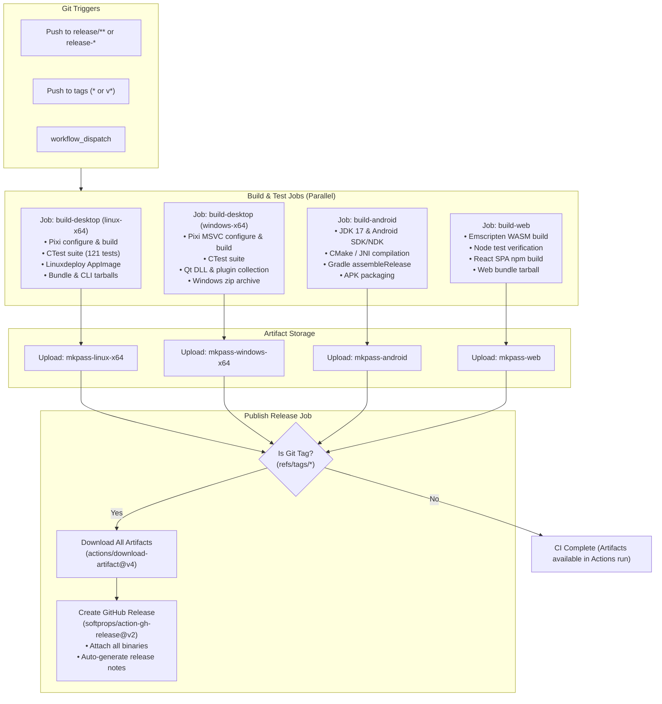

# Technical Implementation Plan: GitHub Actions CI/CD Pipeline

This document defines the technical architecture, workflow specifications, and implementation roadmap for establishing a comprehensive GitHub Actions CI/CD pipeline for `mkpass`. The pipeline supports automated continuous integration testing on release branches, multi-target cross-platform builds, and automated artifact publishing to GitHub Releases upon tag creation, modeled after the proven architecture in [`/home/kgorelov/git/qworldclock`](file:///home/kgorelov/git/qworldclock/.github/workflows/release.yml).

---

## 1. Executive Summary & Objectives

`mkpass` is a cross-platform password and passphrase generator comprising four distinct target application environments:
1. **Desktop Applications (Linux & Windows)**: C++20 CLI (`mkpass`) and Qt GUI (`mkpass-gui`).
2. **Android Application**: Native Android app (`app.mkpass`) with JNI C++ bindings (`libmkpass.so`).
3. **Web Application**: Emscripten WebAssembly core (`mkpass_webasm`) paired with a React/TypeScript Single Page Application (`mkpass_web`).

### Core Requirements
1. **Release Branch CI**: Automatically trigger comprehensive build, test, and artifact packaging workflows on release branches (`release/**` and `release-*`).
2. **Release Tag Artifact Creation**: Automatically trigger builds on release tags (`*` / `v*`), collect all compiled distribution packages across all targets, and publish a GitHub Release with attached downloadable assets.
3. **Comprehensive Platform Coverage**: Produce ready-to-run deliverables for:
   - **Linux (x86_64)**: Standalone AppImage, bundle tarball with embedded Qt/runtimes, and standalone CLI binary.
   - **Windows (x64)**: Portable zip archive containing `mkpass-gui.exe`, `mkpass.exe`, required Qt runtime DLLs, platform plugins, and runtimes.
   - **Android**: Installable release APK (`.apk`).
   - **Web**: Production web distribution bundle (`.tar.gz`) containing static HTML/JS/CSS and compiled WebAssembly binaries.
4. **Reproducible & Hermetic Environments**: Leverage [Pixi](file:///home/kgorelov/git/mkpass/pixi.toml) (`prefix-dev/setup-pixi`) for desktop builds to guarantee consistent toolchains (compilers, CMake, Ninja, Qt, SQLite, GTest) across Linux and Windows runners without environmental drift.

---

## 2. Pipeline Architecture & Workflow Flow



---

## 3. Trigger & Branching Strategy

| Event | Pattern / Filter | Behavior | Release Published? |
|---|---|---|---|
| **Release Branches** | `push.branches: ['release/**', 'release-*']` | Executes full compilation, test execution, artifact creation, and artifact upload across all 4 targets | No (Artifacts stored in CI run for QA) |
| **Release Tags** | `push.tags: ['*']` | Executes full compilation, test execution, artifact creation, artifact upload, and creates a formal GitHub Release | **Yes** (All assets attached) |
| **Manual Trigger** | `workflow_dispatch` | Manual pipeline dispatch from GitHub UI with custom inputs (e.g. branch selection) | Only if ref is a tag |
| **Pull Requests / Main** | `pull_request` / `main` (optional via [`ci.yml`](file:///home/kgorelov/git/mkpass/.github/workflows/ci.yml)) | Fast PR verification (build & test) without packaging or publishing | No |

---

## 4. Deliverable Matrix & Packaging Specifications

All distribution assets will adhere to a consistent naming scheme incorporating the sanitized Git tag or branch reference (`${TAG_NAME}` where forward slashes are converted to hyphens):

| Component | Target Platform | Distribution Package | Contents & Packaging Logic |
|---|---|---|---|
| **Linux GUI** | Linux x86_64 | `mkpass-${TAG}-linux-x86_64.AppImage` | Self-contained executable image created via `linuxdeploy` and `linuxdeploy-plugin-qt`. Contains `mkpass-gui`, bundled Qt libraries, platforms (`libqxcb.so`, `libqoffscreen.so`, `libqwayland.so`), SVG icon engine (`libqsvg.so`), desktop file, and app icons. |
| **Linux Bundle** | Linux x86_64 | `mkpass-${TAG}-linux-x86_64-bundle.tar.gz` | Direct extraction folder created from `AppDir` with an executable launcher script (`mkpass-gui`), providing maximum compatibility on distributions where FUSE or AppImage runtimes are restricted. |
| **Linux CLI** | Linux x86_64 | `mkpass-${TAG}-linux-x86_64-cli.tar.gz` | Standalone CLI binary (`mkpass`) built with `STATIC_CLI=ON` (statically linking `libgcc` and `libstdc++`), ensuring portability across glibc versions. |
| **Windows Desktop** | Windows x64 | `mkpass-${TAG}-windows-x64.zip` | Portable directory containing `mkpass-gui.exe`, `mkpass.exe`, required Qt DLLs (`Qt5Core.dll`, `Qt5Gui.dll`, `Qt5Widgets.dll`, `Qt5Concurrent.dll`), platform plugin (`platforms/qwindows.dll`), SVG plugin (`imageformats/qsvg.dll`, `iconengines/qsvgicon.dll`), and MSVC C++ runtime dependencies. |
| **Android App** | Android (ARM64, ARMv7, x86_64) | `mkpass-${TAG}-android.apk` | Universal APK containing compiled Dalvik/ART bytecode, native JNI libraries (`libmkpass.so` built across all supported ABIs: `arm64-v8a`, `armeabi-v7a`, `x86_64`), and embedded assets. |
| **Web Application** | Modern Web Browsers | `mkpass-${TAG}-web.tar.gz` | Production static web application directory containing `index.html`, compiled React JavaScript bundles, styling, `mkpass_webasm.js`, and `mkpass_webasm.wasm`, ready to deploy directly to GitHub Pages, Cloudflare Pages, S3, or Nginx. |

---

## 5. Detailed Job Specifications

### 5.1 Job 1: Desktop Build & Packaging Matrix (`build-desktop`)

Runs in parallel across Linux and Windows using runner matrix:
- `ubuntu-latest` (`platform: linux-x64`)
- `windows-latest` (`platform: windows-x64`)

#### Step Breakdown:
1. **Checkout Repository**: `actions/checkout@v4`.
2. **Setup Pixi**: `prefix-dev/setup-pixi@v0.10.2` with `cache: true`. This provisions CMake, Ninja, C++ compiler (GCC/MSVC), Qt 5.15, SQLite, and GTest from Conda Forge.
3. **Configure & Build**:
   - `pixi run configure`
   - `pixi run build`
4. **Execute Tests**:
   - `env: QT_QPA_PLATFORM: offscreen`
   - `pixi run test` (executes all 121 unit, integration, and GUI tests with `--output-on-failure`).
5. **Package Linux**:
   - Execute [`scripts/build_appimage.sh`](file:///home/kgorelov/git/mkpass/scripts/build_appimage.sh) via `pixi run appimage`.
   - Copy generated `mkpass-x86_64.AppImage` to `dist/mkpass-${TAG_NAME}-linux-x86_64.AppImage`.
   - Bundle `AppDir` into `dist/mkpass-${TAG_NAME}-linux-x86_64-bundle.tar.gz` with top-level launcher script.
   - Package standalone CLI binary: `tar -czvf dist/mkpass-${TAG_NAME}-linux-x86_64-cli.tar.gz -C build/cli mkpass`.
6. **Package Windows**:
   - Stage directory `package/mkpass/`.
   - Copy `build/cli/mkpass.exe` and `build/gui/mkpass-gui.exe`.
   - Copy required Qt DLLs from `$CONDA_PREFIX/Library/bin` (or `$CONDA_PREFIX/bin`).
   - Copy Qt plugins: `platforms/qwindows.dll`, `iconengines/qsvgicon.dll`, `imageformats/qsvg.dll`.
   - Compress folder into `dist/mkpass-${TAG_NAME}-windows-x64.zip`.
7. **Upload Artifacts**:
   - `actions/upload-artifact@v4` with `name: mkpass-${{ matrix.platform }}` and `path: dist/*`.

### 5.2 Job 2: Android Build (`build-android`)

Runs on `ubuntu-latest`.

#### Step Breakdown:
1. **Checkout Repository**: `actions/checkout@v4`.
2. **Setup Java**: `actions/setup-java@v4` with `distribution: 'temurin'` and `java-version: '17'`.
3. **Setup Android SDK & NDK**:
   - Default GitHub Actions `ubuntu-latest` image includes Android SDK and NDK.
   - Set `ANDROID_HOME` / ensure NDK (e.g. 26.x or 25.x) is accessible to CMake.
4. **Make Gradle Wrapper Executable**: `chmod +x android/gradlew`.
5. **Build APK**:
   - Run `./gradlew assembleRelease` (or `./gradlew assembleDebug` if release signing key secret is not configured).
   - If keystore secrets (`ANDROID_KEYSTORE_BASE64`, `KEYSTORE_PASSWORD`, etc.) are provided in GitHub Secrets, sign the release APK; otherwise produce and publish the unsigned release APK or debug APK.
6. **Package & Stage Artifact**:
   - Locate generated APK (`android/app/build/outputs/apk/release/app-release-unsigned.apk` or `debug/app-debug.apk`).
   - Copy to `dist/mkpass-${TAG_NAME}-android.apk`.
7. **Upload Artifact**:
   - `actions/upload-artifact@v4` with `name: mkpass-android` and `path: dist/*`.

### 5.3 Job 3: Web Build (`build-web`)

Runs on `ubuntu-latest`.

#### Step Breakdown:
1. **Checkout Repository**: `actions/checkout@v4`.
2. **Setup Emscripten SDK**: `mymindstorm/setup-emsdk@v14` with `version: '3.1.56'` (or latest stable).
3. **Compile WebAssembly Core**:
   - Make script executable: `chmod +x build_wasm.sh`.
   - Execute [`./build_wasm.sh`](file:///home/kgorelov/git/mkpass/build_wasm.sh).
   - Verifies Emscripten build (`emcmake cmake`, `emmake make`), copies `mkpass_webasm.js` and `mkpass_webasm.wasm` to `mkpass_web/public/`, and runs `node mkpass_webasm/test_wasm.js`.
4. **Setup Node.js**: `actions/setup-node@v4` with `node-version: '20'` and `cache: 'npm'` (working-directory: `mkpass_web`).
5. **Build React Web Application**:
   - Working directory: `mkpass_web`.
   - Run `npm ci`.
   - Run `CI=false npm run build` (generates production static bundle in `mkpass_web/build/`).
   - Run `npm test -- --watchAll=false` to verify test suite.
6. **Package Web Distribution**:
   - Compress `mkpass_web/build/` into `dist/mkpass-${TAG_NAME}-web.tar.gz`.
7. **Upload Artifact**:
   - `actions/upload-artifact@v4` with `name: mkpass-web` and `path: dist/*`.

### 5.4 Job 4: Release Publication (`publish-release`)

Runs on `ubuntu-latest`.
- **Precondition**: `if: startsWith(github.ref, 'refs/tags/')`
- **Dependencies**: `needs: [build-desktop, build-android, build-web]`

#### Step Breakdown:
1. **Download All Artifacts**:
   - `actions/download-artifact@v4` with `pattern: 'mkpass-*'`, `path: dist`, and `merge-multiple: true`.
2. **Verify Collected Files**:
   - Inspect files in `dist/` (lists AppImage, bundle tarball, CLI tarball, Windows zip, Android APK, Web archive).
3. **Publish GitHub Release**:
   - `softprops/action-gh-release@v2`.
   - `files: dist/*`.
   - `generate_release_notes: true`.
   - `env: GITHUB_TOKEN: ${{ secrets.GITHUB_TOKEN }}`.

---

## 6. Repository Prerequisites & Preparations

Before activating the workflow, minor script and configuration hardening steps should be performed:

1. **[`scripts/build_appimage.sh`](file:///home/kgorelov/git/mkpass/scripts/build_appimage.sh) Hardening**:
   - Adopt the resilient download helper function from `qworldclock` (`curl` or `wget` fallback with retry).
   - Ensure fallback discovery for `$CONDA_PREFIX` (`.pixi/envs/default`).
   - Ensure the Qt SVG icon plugins (`libqsvg.so`, `libqsvgicon.so`) are explicitly copied into `AppDir/usr/plugins/` so that our SVG icons render cleanly inside the AppImage.

2. **[`build_wasm.sh`](file:///home/kgorelov/git/mkpass/build_wasm.sh) CI Alignment**:
   - Ensure directory creation and paths function smoothly in headless CI runners.
   - Verify non-interactive execution mode.

3. **[`android/app/build.gradle`](file:///home/kgorelov/git/mkpass/android/app/build.gradle) Configuration**:
   - Ensure reproducible release build settings and configure APK output naming.
   - Support optional keystore signing via environment variables (`ANDROID_KEYSTORE_BASE64`, `KEYSTORE_PASSWORD`, `KEY_ALIAS`, `KEY_PASSWORD`) with graceful fallback to unsigned APK if secrets are absent.

4. **Windows Packaging Script / Task in [`pixi.toml`](file:///home/kgorelov/git/mkpass/pixi.toml)**:
   - Provide a clean Windows packaging step or task that resolves Qt DLLs from `$CONDA_PREFIX/Library/bin` and Qt plugins from `$CONDA_PREFIX/Library/plugins`.

---

## 7. Complete Workflow Specification (`release.yml`)

The complete workflow definition to be placed in [`.github/workflows/release.yml`](file:///home/kgorelov/git/mkpass/.github/workflows/release.yml):

```yaml
name: Release

on:
  push:
    branches:
      - 'release/**'
      - 'release-*'
    tags:
      - '*'
  workflow_dispatch:

permissions:
  contents: write

jobs:
  build-desktop:
    name: Desktop (${{ matrix.platform }})
    runs-on: ${{ matrix.os }}
    strategy:
      fail-fast: false
      matrix:
        include:
          - os: ubuntu-latest
            platform: linux-x64
          - os: windows-latest
            platform: windows-x64

    steps:
      - name: Checkout repository
        uses: actions/checkout@v4

      - name: Setup Pixi
        uses: prefix-dev/setup-pixi@v0.10.2
        with:
          pixi-version: latest
          cache: true

      - name: Configure CMake
        run: pixi run configure

      - name: Build application
        run: pixi run build

      - name: Run test suite
        env:
          QT_QPA_PLATFORM: offscreen
        run: pixi run test

      - name: Package Linux
        if: matrix.platform == 'linux-x64'
        shell: bash
        run: |
          mkdir -p dist
          TAG_NAME="${GITHUB_REF_NAME//\//-}"

          # 1. Build AppImage via pixi task
          pixi run appimage

          # 2. Copy generated AppImage to dist
          cp mkpass-x86_64.AppImage "dist/mkpass-${TAG_NAME}-linux-x86_64.AppImage"

          # 3. Standalone bundle tarball (bundles all Qt libraries & plugins)
          mkdir -p package_bundle/mkpass
          cp -a AppDir/* package_bundle/mkpass/
          cat << 'EOF' > package_bundle/mkpass/mkpass-gui
          #!/bin/bash
          HERE="$(dirname "$(readlink -f "$0")")"
          exec "$HERE/usr/bin/mkpass-gui" "$@"
          EOF
          chmod +x package_bundle/mkpass/mkpass-gui
          tar -czvf "dist/mkpass-${TAG_NAME}-linux-x86_64-bundle.tar.gz" -C package_bundle mkpass

          # 4. Standalone CLI tarball
          mkdir -p package_cli/mkpass
          cp build/cli/mkpass package_cli/mkpass/
          tar -czvf "dist/mkpass-${TAG_NAME}-linux-x86_64-cli.tar.gz" -C package_cli mkpass

      - name: Package Windows
        if: matrix.platform == 'windows-x64'
        shell: bash
        run: |
          mkdir -p dist package/mkpass
          TAG_NAME="${GITHUB_REF_NAME//\//-}"

          # Copy binaries
          cp build/cli/mkpass.exe package/mkpass/
          cp build/gui/mkpass-gui.exe package/mkpass/

          # Copy Qt runtime DLLs and plugins from Conda prefix
          if [ -d "$CONDA_PREFIX/Library/bin" ]; then
            PREFIX_BIN="$CONDA_PREFIX/Library/bin"
            PREFIX_PLUGINS="$CONDA_PREFIX/Library/plugins"
          else
            PREFIX_BIN="$CONDA_PREFIX/bin"
            PREFIX_PLUGINS="$CONDA_PREFIX/plugins"
          fi

          cp "$PREFIX_BIN"/Qt5Core.dll package/mkpass/ || true
          cp "$PREFIX_BIN"/Qt5Gui.dll package/mkpass/ || true
          cp "$PREFIX_BIN"/Qt5Widgets.dll package/mkpass/ || true
          cp "$PREFIX_BIN"/Qt5Concurrent.dll package/mkpass/ || true
          cp "$PREFIX_BIN"/Qt5Svg.dll package/mkpass/ || true

          # Platform plugins
          mkdir -p package/mkpass/platforms
          cp "$PREFIX_PLUGINS"/platforms/qwindows.dll package/mkpass/platforms/ || true

          # Icon and image format plugins
          if [ -d "$PREFIX_PLUGINS/iconengines" ]; then
            mkdir -p package/mkpass/iconengines
            cp "$PREFIX_PLUGINS"/iconengines/*.dll package/mkpass/iconengines/ || true
          fi
          if [ -d "$PREFIX_PLUGINS/imageformats" ]; then
            mkdir -p package/mkpass/imageformats
            cp "$PREFIX_PLUGINS"/imageformats/*.dll package/mkpass/imageformats/ || true
          fi

          # Compress portable zip
          cmake -E chdir package cmake -E tar cfv "../dist/mkpass-${TAG_NAME}-windows-x64.zip" --format=zip mkpass

      - name: Upload desktop artifacts
        uses: actions/upload-artifact@v4
        with:
          name: mkpass-${{ matrix.platform }}
          path: dist/*
          if-no-files-found: error

  build-android:
    name: Android (APK)
    runs-on: ubuntu-latest
    steps:
      - name: Checkout repository
        uses: actions/checkout@v4

      - name: Setup Java 17
        uses: actions/setup-java@v4
        with:
          distribution: 'temurin'
          java-version: '17'

      - name: Setup Android SDK
        uses: android-actions/setup-android@v3

      - name: Make gradlew executable
        run: chmod +x android/gradlew

      - name: Build Android APK
        working-directory: android
        run: ./gradlew assembleRelease || ./gradlew assembleDebug

      - name: Package Android Artifact
        shell: bash
        run: |
          mkdir -p dist
          TAG_NAME="${GITHUB_REF_NAME//\//-}"
          APK_FILE=$(find android/app/build/outputs/apk -name "*.apk" | head -n 1)
          if [ -n "$APK_FILE" ]; then
            cp "$APK_FILE" "dist/mkpass-${TAG_NAME}-android.apk"
          else
            echo "Error: No APK file generated" >&2
            exit 1
          fi

      - name: Upload Android artifact
        uses: actions/upload-artifact@v4
        with:
          name: mkpass-android
          path: dist/*
          if-no-files-found: error

  build-web:
    name: Web (WASM + React)
    runs-on: ubuntu-latest
    steps:
      - name: Checkout repository
        uses: actions/checkout@v4

      - name: Setup Emscripten
        uses: mymindstorm/setup-emsdk@v14
        with:
          version: '3.1.56'

      - name: Build WebAssembly Core
        run: |
          chmod +x build_wasm.sh
          ./build_wasm.sh

      - name: Setup Node.js
        uses: actions/setup-node@v4
        with:
          node-version: '20'
          cache: 'npm'
          cache-dependency-path: mkpass_web/package-lock.json

      - name: Build React SPA
        working-directory: mkpass_web
        run: |
          npm ci
          CI=false npm run build

      - name: Package Web Distribution
        shell: bash
        run: |
          mkdir -p dist
          TAG_NAME="${GITHUB_REF_NAME//\//-}"
          tar -czvf "dist/mkpass-${TAG_NAME}-web.tar.gz" -C mkpass_web/build .

      - name: Upload Web artifact
        uses: actions/upload-artifact@v4
        with:
          name: mkpass-web
          path: dist/*
          if-no-files-found: error

  release:
    name: Publish GitHub Release
    needs: [build-desktop, build-android, build-web]
    if: startsWith(github.ref, 'refs/tags/')
    runs-on: ubuntu-latest
    steps:
      - name: Download all build artifacts
        uses: actions/download-artifact@v4
        with:
          pattern: mkpass-*
          path: dist
          merge-multiple: true

      - name: Inspect release assets
        run: ls -la dist/

      - name: Create GitHub Release
        uses: softprops/action-gh-release@v2
        with:
          files: dist/*
          generate_release_notes: true
        env:
          GITHUB_TOKEN: ${{ secrets.GITHUB_TOKEN }}
```

---

## 8. Implementation Steps & Rollout Roadmap

The implementation will proceed in four phases:

### Phase 1: Environment & Script Hardening
1. Refine [`scripts/build_appimage.sh`](file:///home/kgorelov/git/mkpass/scripts/build_appimage.sh) with retry logic, Conda prefix discovery, and SVG plugin verification.
2. Verify [`build_wasm.sh`](file:///home/kgorelov/git/mkpass/build_wasm.sh) non-interactive execution and clean staging.
3. Validate Android Gradle build parameters for headless CI runners.

### Phase 2: Workflow Deployment
1. Deploy [`.github/workflows/release.yml`](file:///home/kgorelov/git/mkpass/.github/workflows/release.yml) with all four parallel jobs and conditional release step.
2. Update existing [`.github/workflows/ci.yml`](file:///home/kgorelov/git/mkpass/.github/workflows/ci.yml) to trigger on PRs and `master` branch pushes for rapid validation.

### Phase 3: Dry-Run Verification
1. Push to a test release branch (e.g. `release-ci-test`) and verify:
   - Linux desktop build & test pass; AppImage, bundle, and CLI tarballs upload.
   - Windows desktop build & test pass; zip archive uploads.
   - Android Gradle build succeeds; APK uploads.
   - Web Emscripten & React builds succeed; web tarball uploads.
   - Ensure the `release` job is skipped (since the ref is a branch, not a tag).

### Phase 4: Release Tag Verification
1. Push a release tag (e.g. `v0.1.0-test` or production tag).
2. Confirm that all four build jobs succeed and the `release` job executes, downloading all artifacts and publishing a release with all downloadable deliverables.

---

## 9. Verification & Troubleshooting Guide

| Issue | Root Cause | Solution |
|---|---|---|
| **AppImage creation fails in container** | Missing FUSE support on GitHub Actions virtual machine | Always pass `--appimage-extract-and-run` flag to `linuxdeploy` and its plugins. |
| **GUI tests fail on headless runner** | No X11/Wayland display server active | Set environment variable `QT_QPA_PLATFORM: offscreen` in workflow test step. |
| **Android NDK not detected by CMake** | NDK version not found in standard SDK path | Explicitly set `android-actions/setup-android@v3` or allow AGP default NDK resolution. |
| **Windows bash path conversion** | MSYS/Cygwin path mangling of `/` to Windows drives | Use `cmake -E tar` and avoid mixed slash formats in Windows bash steps. |
| **Web build fails on React warnings** | CRA treats ESLint warnings as errors when `CI=true` | Run `CI=false npm run build` in the workflow step. |
