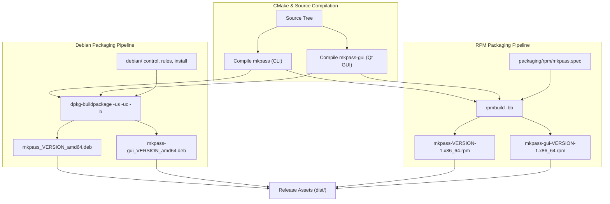
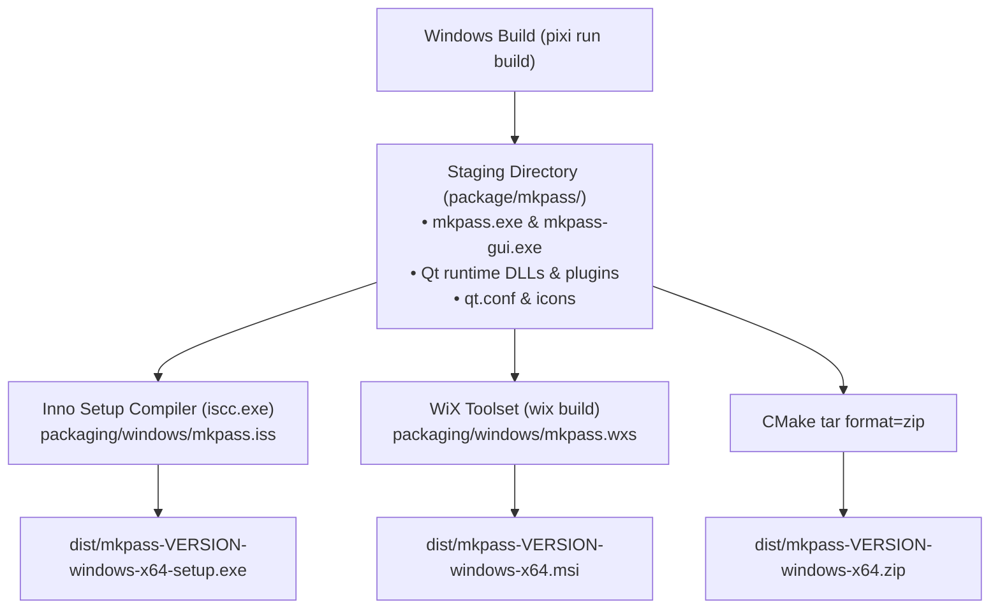
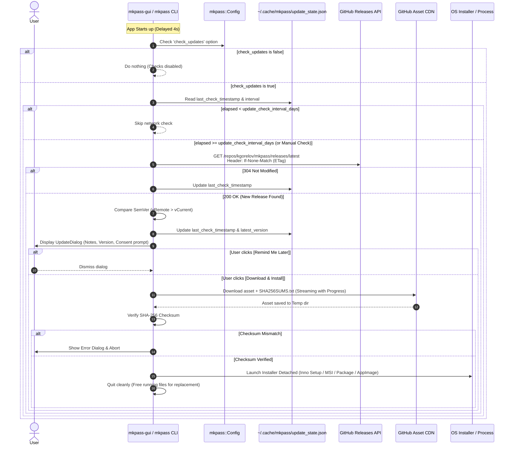
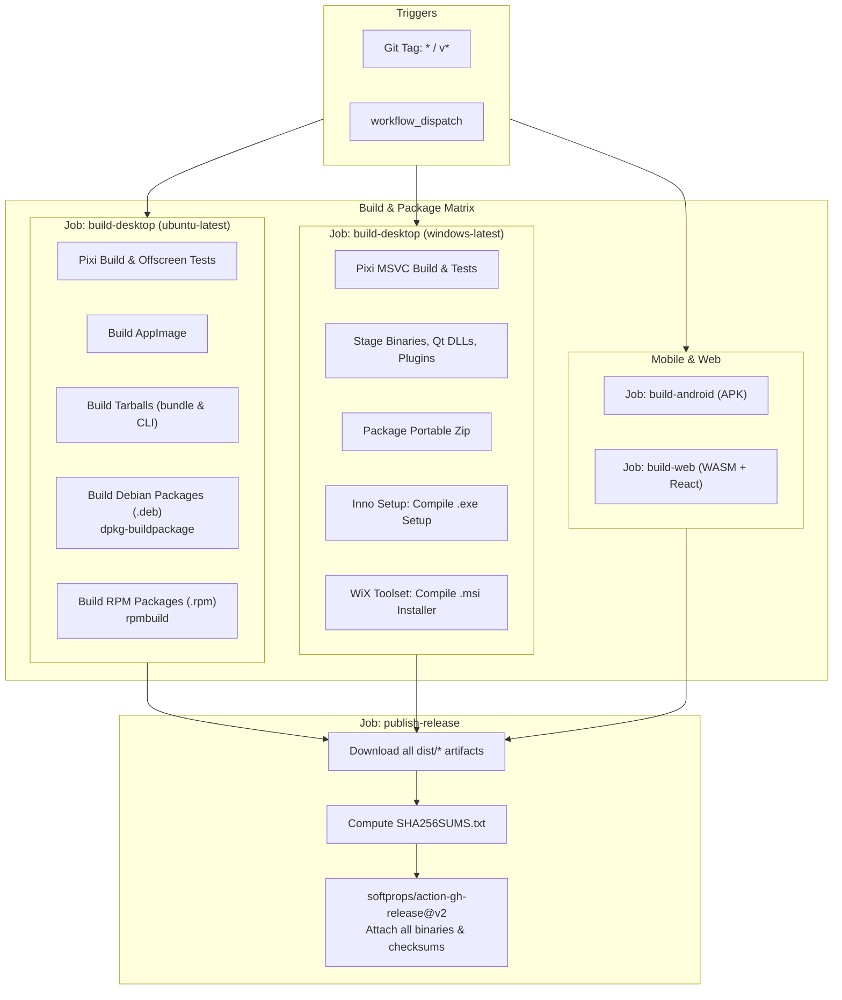
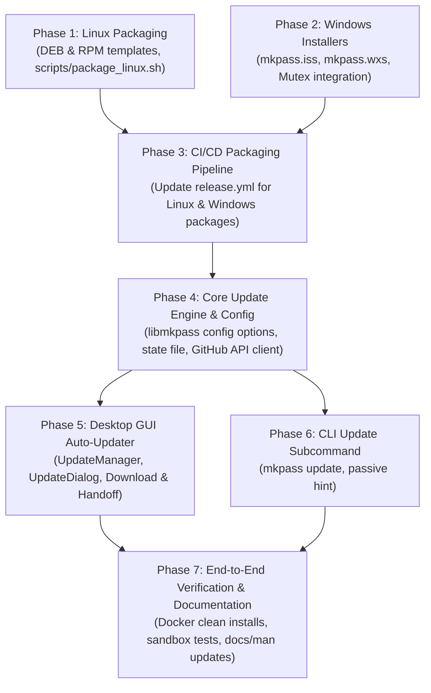

# Technical Implementation Plan: Extended Distribution Packages & Self-Updating System

This document defines the technical architecture, package specifications, update lifecycle, and implementation roadmap for expanding the distribution deliverables of `mkpass` on GitHub Releases and introducing an integrated, user-consented self-updating mechanism across desktop platforms.

---

## 1. Executive Summary & Objectives

`mkpass` currently provides standalone distribution artifacts for Linux (AppImage, bundle tarball, standalone CLI tarball), Windows (portable zip archive), Android (APK), and Web (WASM + React bundle) via [`.github/workflows/release.yml`](file:///home/kgorelov/git/mkpass/.github/workflows/release.yml).

### Primary Objectives:
1. **Expand Linux Packaging**:
   - Deliver native `.deb` packages for Debian, Ubuntu, Linux Mint, and derivatives.
   - Deliver native `.rpm` packages for Fedora, RHEL, CentOS, Rocky Linux, openSUSE, and derivatives.
   - Support both modular split packages (`mkpass` CLI and `mkpass-gui` GUI) and unified desktop packages.
2. **Expand Windows Packaging**:
   - Deliver a standard graphical installer (`.exe`) created with **Inno Setup**, featuring desktop/start-menu shortcuts, PATH registration for the CLI, and a clean uninstaller.
   - Deliver an enterprise Windows Installer package (`.msi`) created with **WiX Toolset**, enabling silent corporate deployment via Group Policy (GPO), Microsoft Intune, and SCCM.
3. **Integrated Update Checking & Auto-Updating**:
   - Periodically check for new releases in the background (default: every 7 days) via the GitHub Releases API.
   - Strictly honor user privacy and configuration: allow disabling checks via `check_updates = false` in [`libmkpass/config.h`](file:///home/kgorelov/git/mkpass/libmkpass/config.h), the CLI (`mkpass config set check_updates false`), or the GUI Preferences dialog.
   - When an update is detected, prompt the user with release notes and version diffs.
   - Upon explicit user consent, automatically download the platform-appropriate installer/package, verify cryptographic integrity (SHA-256), and invoke the installer or update the executable.

---

## 2. Deliverable Matrix & Packaging Specifications

The extended release asset matrix adheres to consistent semantic naming:

| Asset Name | Target OS & Distro | Format | Build Tool / Strategy | Install Destination | Desktop & Shell Integration |
|---|---|---|---|---|---|
| `mkpass_${VERSION}_amd64.deb`<br>`mkpass-gui_${VERSION}_amd64.deb` | Debian 12+, Ubuntu 22.04+ (x86_64) | Debian Package (`.deb`) | `dpkg-buildpackage` using [`debian/`](file:///home/kgorelov/git/mkpass/debian/) control tree | `/usr/bin/mkpass`<br>`/usr/bin/mkpass-gui` | Desktop launcher (`.desktop`), 256x256 icon, man pages (`mkpass.1.gz`, `mkpass-gui.1.gz`) |
| `mkpass-${VERSION}-1.x86_64.rpm`<br>`mkpass-gui-${VERSION}-1.x86_64.rpm` | Fedora 38+, RHEL 9+, openSUSE (x86_64) | RPM Package (`.rpm`) | `rpmbuild` via `.spec` template or CPack RPM generator | `/usr/bin/mkpass`<br>`/usr/bin/mkpass-gui` | Desktop launcher (`.desktop`), icon, man pages, mime database refresh |
| `mkpass-${TAG}-linux-x86_64.AppImage` | Universal Linux x86_64 | AppImage | `linuxdeploy` + Qt plugin via [`scripts/build_appimage.sh`](file:///home/kgorelov/git/mkpass/scripts/build_appimage.sh) | Portable / User directory | Self-contained executable image with embedded Qt runtimes |
| `mkpass-${TAG}-linux-x86_64-bundle.tar.gz` | Linux x86_64 (No FUSE required) | Tarball (`.tar.gz`) | AppDir archive with wrapper launcher | Portable | Extracted folder with embedded Qt libraries |
| `mkpass-${TAG}-linux-x86_64-cli.tar.gz` | Linux x86_64 | Tarball (`.tar.gz`) | `STATIC_CLI=ON` binary packaging | Portable | Standalone CLI binary without GUI dependencies |
| `mkpass-${TAG}-windows-x64-setup.exe` | Windows 10/11 x64 | Setup Installer (`.exe`) | **Inno Setup** compiler (`iscc`) | `C:\Program Files\mkpass` (or per-user) | Start Menu shortcut, Desktop shortcut, optional PATH environment variable, Add/Remove Programs |
| `mkpass-${TAG}-windows-x64.msi` | Windows 10/11 x64 | Windows Installer (`.msi`) | **WiX Toolset** v4 / CPack WIX | `C:\Program Files\mkpass` | Enterprise MSI database, Start Menu shortcut, silent deployment support (`msiexec /i ... /qn`) |
| `mkpass-${TAG}-windows-x64.zip` | Windows 10/11 x64 | Portable Zip (`.zip`) | [`scripts/package_windows.sh`](file:///home/kgorelov/git/mkpass/scripts/package_windows.sh) | User directory | Portable folder containing `mkpass-gui.exe`, `mkpass.exe`, DLLs, `qt.conf` |
| `SHA256SUMS.txt` | All platforms | Plain text checksums | `sha256sum *` | Release page | Cryptographic integrity validation for down loaders and self-updater |

---

## 3. Linux Packaging Architecture (.deb & .rpm)



### 3.1 Debian / Ubuntu Packages (`.deb`)

The repository already includes the foundation in [`debian/`](file:///home/kgorelov/git/mkpass/debian/):
- [`debian/control`](file:///home/kgorelov/git/mkpass/debian/control): Defines `Source: mkpass`, Package `mkpass` (CLI), and Package `mkpass-gui` (Qt GUI).
- [`debian/rules`](file:///home/kgorelov/git/mkpass/debian/rules): Uses debhelper `dh $@ --buildsystem=cmake`.
- [`debian/mkpass.install`](file:///home/kgorelov/git/mkpass/debian/mkpass.install): Installs `usr/bin/mkpass`.
- [`debian/mkpass-gui.install`](file:///home/kgorelov/git/mkpass/debian/mkpass-gui.install): Installs `usr/bin/mkpass-gui`, `usr/share/applications/mkpass.desktop`, and `usr/share/icons/hicolor/256x256/apps/mkpass.png`.

#### Enhancements Needed:
1. **Man Pages Installation**:
   - Add `debian/mkpass.manpages`: `docs/man/mkpass.1`
   - Add `debian/mkpass-gui.manpages`: `docs/man/mkpass-gui.1`
2. **Package Relationship & Dependencies**:
   - Configure `mkpass-gui` to recommend or depend on `mkpass`.
   - Ensure `Build-Depends` supports both Qt5 (`qtbase5-dev`) and Qt6 (`qt6-base-dev`).
3. **Automated Changelog Generation**:
   - In CI, automatically update [`debian/changelog`](file:///home/kgorelov/git/mkpass/debian/changelog) with the target release version (`${TAG#v}`) and current RFC 2822 date prior to running `dpkg-buildpackage`.
4. **CI Build Command**:
   ```bash
   sudo apt-get update && sudo apt-get install -y debhelper cmake qtbase5-dev libgtest-dev libsqlite3-dev
   dpkg-buildpackage -us -uc -b
   ```

### 3.2 RPM Packages (`.rpm`)

To generate native RPM packages on GitHub Actions runners without requiring a Fedora VM, we use `rpmbuild` (available on Ubuntu via `sudo apt-get install -y rpm`).

#### Implementation: `packaging/rpm/mkpass.spec`
Create a clean RPM spec file supporting modular subpackages:

```spec
Name:           mkpass
Version:        %{version}
Release:        1%{?dist}
Summary:        Secure password and passphrase generator using Argon2 and HKDF
License:        MIT
URL:            https://github.com/kgorelov/mkpass
Source0:        mkpass-%{version}.tar.gz

BuildRequires:  cmake >= 3.20
BuildRequires:  gcc-c++
BuildRequires:  sqlite-devel
BuildRequires:  qt5-qtbase-devel

%description
mkpass is a deterministic, stateless password and passphrase generator
utilizing Argon2, HMAC-SHA512, and Diceware algorithms. This package provides the CLI.

%package gui
Summary:        Qt graphical interface for mkpass password generator
Requires:       %{name} = %{version}-%{release}
Requires:       qt5-qtbase-gui

%description gui
Graphical user interface (Qt) for the mkpass password generator.

%prep
%setup -q

%build
%cmake -DWITH_GUI=ON -DWITH_TESTS=OFF -DCMAKE_BUILD_TYPE=Release
%cmake_build

%install
%cmake_install
install -Dpm 0644 docs/man/mkpass.1 %{buildroot}%{_mandir}/man1/mkpass.1
install -Dpm 0644 docs/man/mkpass-gui.1 %{buildroot}%{_mandir}/man1/mkpass-gui.1

%files
%{_bindir}/mkpass
%{_mandir}/man1/mkpass.1*

%files gui
%{_bindir}/mkpass-gui
%{_datadir}/applications/mkpass.desktop
%{_datadir}/icons/hicolor/256x256/apps/mkpass.png
%{_mandir}/man1/mkpass-gui.1*

%changelog
```

#### Build Execution Script (`scripts/package_linux.sh`):
A unified script executes both packaging pipelines in CI:
- Updates package metadata and version strings.
- Runs `dpkg-buildpackage` to output `.deb` packages to `dist/`.
- Runs `rpmbuild -ba packaging/rpm/mkpass.spec` to output `.rpm` packages to `dist/`.

---

## 4. Windows Installer Implementations (.exe & .msi)



### 4.1 Inno Setup EXE Installer (`.exe`)

**Inno Setup** is selected for the standard executable setup wizard due to its compact overhead, seamless 64-bit Windows support, automatic desktop/start-menu shortcut creation, uninstaller generation, and command-line silent execution flags (`/SILENT`, `/VERYSILENT`).

#### Script Specification: `packaging/windows/mkpass.iss`
```iss
#define MyAppName "mkpass"
#define MyAppPublisher "Kirill Gorelov"
#define MyAppURL "https://github.com/kgorelov/mkpass"
#define MyAppExeName "mkpass-gui.exe"
#define MyAppCliName "mkpass.exe"
#ifndef MyAppVersion
  #define MyAppVersion "0.1.0"
#endif

[Setup]
AppId={{9B78D82C-13D9-4B5D-8F68-E9B0F1C865A1}
AppName={#MyAppName}
AppVersion={#MyAppVersion}
AppPublisher={#MyAppPublisher}
AppPublisherURL={#MyAppURL}
AppSupportURL={#MyAppURL}
AppUpdatesURL={#MyAppURL}
DefaultDirName={autopf}\{#MyAppName}
DefaultGroupName={#MyAppName}
AllowNoIcons=yes
OutputDir=..\..\dist
OutputBaseFilename=mkpass-{#MyAppVersion}-windows-x64-setup
Compression=lzma2/ultra64
SolidCompression=yes
ArchitecturesAllowed=x64compatible
ArchitecturesInstallIn64BitMode=x64compatible
SetupIconFile=..\..\icons\mkpass_256.ico
UninstallDisplayIcon={app}\{#MyAppExeName}
AppMutex=mkpass_gui_mutex

[Tasks]
Name: "desktopicon"; Description: "{cm:CreateDesktopIcon}"; GroupDescription: "{cm:AdditionalIcons}"; Flags: unchecked
Name: "addtopath"; Description: "Add mkpass CLI to system PATH"; GroupDescription: "Environment Configuration:"; Flags: unchecked

[Files]
Source: "..\..\package\mkpass\*"; DestDir: "{app}"; Flags: ignoreversion recursesubdirs createallsubdirs

[Icons]
Name: "{group}\{#MyAppName}"; Filename: "{app}\{#MyAppExeName}"
Name: "{group}\{cm:UninstallProgram,{#MyAppName}}"; Filename: "{uninstallexe}"
Name: "{autodesktop}\{#MyAppName}"; Filename: "{app}\{#MyAppExeName}"; Tasks: desktopicon

[Registry]
; Add to system PATH if task is checked
Root: HKLM; Subkey: "SYSTEM\CurrentControlSet\Control\Session Manager\Environment"; \
    ValueType: expandsz; ValueName: "Path"; ValueData: "{olddata};{app}"; \
    Tasks: addtopath; Check: NeedsAddPath(ExpandConstant('{app}'))

[Run]
Filename: "{app}\{#MyAppExeName}"; Description: "{cm:LaunchProgram,{#StringChange(MyAppName, '&', '&&')}}"; Flags: nowait postinstall skipifsilent

[Code]
// Helper function to prevent duplicate PATH entries
function NeedsAddPath(Param: string): boolean;
var
  OrigPath: string;
begin
  if not RegQueryStringValue(HKEY_LOCAL_MACHINE,
    'SYSTEM\CurrentControlSet\Control\Session Manager\Environment',
    'Path', OrigPath)
  then begin
    Result := True;
    exit;
  end;
  Result := Pos(';' + UpperCase(Param) + ';', ';' + UpperCase(OrigPath) + ';') = 0;
end;
```

#### Key Capabilities:
- **`AppMutex=mkpass_gui_mutex`**: When running an upgrade or uninstaller, Inno Setup checks if `mkpass-gui` is currently active and prompts the user to close it cleanly before replacing files.
- **PATH Registration**: Enables direct usage of `mkpass` in PowerShell and Command Prompt without manually editing system environment variables.
- **Silent Update Support**: Can be invoked unattended by our auto-updater using `/SILENT /NORESTART` or `/VERYSILENT /NORESTART`.

### 4.2 WiX Toolset MSI Installer (`.msi`)

**WiX Toolset** compiles declarative XML into Windows Installer (`.msi`) relational databases, providing native enterprise manageability:
- Standard installation database recognized by Active Directory GPO, Microsoft Intune, and SCCM.
- Complete support for `msiexec /i mkpass.msi /qn` silent deployments and `msiexec /x mkpass.msi /qn` uninstalls.
- Built-in `MajorUpgrade` scheduling to ensure version upgrades seamlessly uninstall previous builds without leaving orphaned files or broken registry entries.

#### Specification: `packaging/windows/mkpass.wxs`
```xml
<?xml version="1.0" encoding="UTF-8"?>
<Wix xmlns="http://wixtoolset.org/schemas/v4/wxs">
  <Package Name="mkpass"
           Manufacturer="Kirill Gorelov"
           Version="$(var.Version)"
           UpgradeCode="C8B92D10-53D2-487C-904A-48356984D2F1"
           Scope="perMachine">

    <MajorUpgrade DowngradeErrorMessage="A newer version of [ProductName] is already installed." />
    <MediaTemplate EmbedCab="yes" CompressionLevel="high" />

    <StandardDirectory Id="ProgramFiles64Folder">
      <Directory Id="INSTALLFOLDER" Name="mkpass" />
    </StandardDirectory>

    <StandardDirectory Id="ProgramMenuFolder">
      <Directory Id="ApplicationProgramsFolder" Name="mkpass" />
    </StandardDirectory>

    <DirectoryRef Id="ApplicationProgramsFolder">
      <Component Id="ApplicationShortcut" Guid="7D1E8F6A-35B2-4A7C-8E2A-108A4D592C7F">
        <Shortcut Id="ApplicationStartMenuShortcut"
                  Name="mkpass"
                  Description="Secure Password Generator"
                  Target="[INSTALLFOLDER]mkpass-gui.exe"
                  WorkingDirectory="INSTALLFOLDER" />
        <RemoveFolder Id="CleanUpShortCut" On="uninstall" />
        <RegistryValue Root="HKCU" Key="Software\mkpass" Name="installed" Type="integer" Value="1" KeyPath="yes" />
      </Component>
    </DirectoryRef>

    <Feature Id="MainProduct" Title="mkpass Application" Level="1">
      <ComponentGroupRef Id="AppFiles" />
      <ComponentRef Id="ApplicationShortcut" />
    </Feature>
  </Package>
</Wix>
```

#### Harvesting Staged Files:
In CI, `wix extension add WixToolset.Heat` or `heat.exe dir package/mkpass -cg AppFiles -dr INSTALLFOLDER -sfrag -srd -var var.SourceDir -out files.wxs` dynamically generates components for all Qt DLLs, plugins, and icons without requiring brittle hardcoding of individual library file names in the WiX source.

---

## 5. Periodic Update Checking & Automatic Installation System

### 5.1 Architecture & Flow Overview



### 5.2 Configuration Integration & Schema

The configuration system in [`libmkpass/config.h`](file:///home/kgorelov/git/mkpass/libmkpass/config.h) and [`libmkpass/config.cpp`](file:///home/kgorelov/git/mkpass/libmkpass/config.cpp) will be extended to support update management settings.

#### New Options in `ConfigOptions`:
| Option Key | TOML Type | CLI Equivalent | Valid Values | Built-in Default | Description |
|---|---|---|---|---|---|
| `check_updates` | boolean | `--check-updates`<br>`MKPASS_CHECK_UPDATES` | `true`, `false` (`1`/`0`, `y`/`n`) | `true` | Enable periodic background checks for newer versions |
| `update_check_interval_days` | integer | `update_check_interval_days` | `1`..`365` | `7` | Days between automatic periodic update checks |
| `update_channel` | string | `update_channel` | `"stable"`, `"prerelease"` | `"stable"` | Release channel to monitor |

#### CLI Subcommands:
- `mkpass config get check_updates` -> outputs `true` or `false`
- `mkpass config set check_updates false` -> disables update checking
- `mkpass config set update_check_interval_days 14` -> changes check frequency to two weeks
- `mkpass update [--check-only] [--yes]` -> checks or executes update directly from CLI

#### GUI Settings Integration:
- In [`SettingsDialog`](file:///home/kgorelov/git/mkpass/gui/settings_dialog.h), add a new entry to the "General" group:
  - Checkbox: Enabled / Disabled
  - Name: `check_updates`
  - Value: `true` / `false`
  - Tooltip: "Check for new releases periodically and notify when an update is available"

### 5.3 State Tracking & Privacy Policy

To avoid modifying user configuration files (`mkpass.conf`) every time an update check runs, operational update state is stored in a platform-standard cache directory:
- **Linux**: `$XDG_CACHE_HOME/mkpass/update_state.json` (defaults to `~/.cache/mkpass/update_state.json`)
- **Windows**: `%LOCALAPPDATA%\mkpass\update_state.json`

#### State Schema (`update_state.json`):
```json
{
  "last_check_timestamp": 1790892400,
  "last_etag": "W/\"a1b2c3d4e5f6\"",
  "latest_known_version": "0.2.0",
  "skipped_version": ""
}
```

#### Privacy & Operational Guarantees:
1. **Zero Telemetry**: The client transmits zero tracking information, system diagnostics, passwords, or usage analytics. Only standard HTTP headers (`User-Agent: mkpass/<version> (<os>-<arch>)`) are sent.
2. **Conditional Requests (ETags)**: When checking for updates, the client passes `If-None-Match: <last_etag>`. If no new release exists, GitHub responds with `304 Not Modified`, saving bandwidth and preventing rate limit exhaustion (GitHub API grants 60 unauthenticated requests/hour per IP).
3. **Fail-Safe Offline Mode**: If network connectivity is missing or the DNS request fails, the application silently fails the update check and proceeds immediately without blocking or lagging UI startup or CLI password derivation.

### 5.4 GitHub Releases API Client & Target Asset Resolution

The updater queries:
`GET https://api.github.com/repos/kgorelov/mkpass/releases/latest`

#### Asset Resolution Engine:
The updater determines the running application's environment and matches the optimal downloadable deliverable from the release's `assets` array:

```cpp
enum class InstallType {
    WindowsInnoSetup,  // Detected via registry or uninstall entry
    WindowsMsi,        // Detected via Windows Installer database
    WindowsPortable,   // Running from standalone zip extraction
    LinuxAppImage,     // getenv("APPIMAGE") != nullptr
    LinuxDeb,          // /etc/debian_version exists & installed to /usr/bin/
    LinuxRpm,          // /etc/redhat-release or openSUSE & installed to /usr/bin/
    LinuxBundle        // Generic bundle / user directory
};
```

#### Asset Mapping Strategy:
- **Windows Setup**: Matches `mkpass-*-windows-x64-setup.exe`.
- **Windows MSI**: Matches `mkpass-*-windows-x64.msi`.
- **Windows Portable**: Matches `mkpass-*-windows-x64.zip`.
- **Linux AppImage**: Matches `mkpass-*-linux-x86_64.AppImage`.
- **Linux Debian**: Matches `mkpass-gui_*_amd64.deb` (for GUI) or `mkpass_*_amd64.deb` (for CLI).
- **Linux RPM**: Matches `mkpass-gui-*.x86_64.rpm` (for GUI) or `mkpass-*.x86_64.rpm` (for CLI).
- **Linux Generic**: Matches `mkpass-*-linux-x86_64-bundle.tar.gz`.

### 5.5 Desktop GUI Implementation (`gui`)

#### 5.5.1 UpdateManager Architecture
Create [`gui/update_manager.h`](file:///home/kgorelov/git/mkpass/gui/update_manager.h) and `gui/update_manager.cpp`:
- Inherits `QObject`.
- Uses `QNetworkAccessManager` for non-blocking asynchronous HTTPS communication.
- Manages check intervals, state file persistence, SemVer comparisons, and asset downloading.

```cpp
class UpdateManager : public QObject {
    Q_OBJECT
public:
    explicit UpdateManager(QObject *parent = nullptr);

    void checkForUpdatesInBackground(); // Triggered 4s after startup
    void checkForUpdatesInteractive();  // Triggered via Help -> Check for Updates...

signals:
    void updateAvailable(const ReleaseInfo &info);
    void upToDate();
    void checkFailed(const QString &errorReason);
    void downloadProgress(qint64 received, qint64 total);
    void downloadFinished(const QString &localFilePath);

public slots:
    void startDownload(const ReleaseAsset &asset);
    void cancelDownload();
    void installDownloadedUpdate(const QString &localFilePath);

private:
    QNetworkAccessManager networkManager_;
    mkpass::Config config_;
    bool isManualCheck_ = false;
    void handleReleaseResponse(QNetworkReply *reply);
};
```

#### 5.5.2 User Interface: `UpdateDialog`
When an update is detected, an informative modal dialog is presented:
- **Header**: "A new version of mkpass is available: **v0.2.0** (current: v0.1.0)".
- **Changelog Area**: Scrollable `QTextBrowser` rendering GitHub release notes (Markdown/HTML).
- **Asset Details**: Indicates package type (e.g. "Windows 64-bit Setup Installer") and download size (e.g. `24.5 MB`).
- **Options**:
  - `[ ] Skip this version (v0.2.0)`
  - `[ ] Prohibit future automatic update checks` (unsets/disables `check_updates` in config)
- **Action Buttons**:
  - `[Download and Install]` (Default highlighted action)
  - `[Remind Me Later]`
  - `[View Release on GitHub]` (opens browser via `QDesktopServices::openUrl`)

#### 5.5.3 Download & Integrity Verification
1. User clicks `[Download and Install]`.
2. A download dialog with progress bar (`received / total bytes` and transfer speed) appears.
3. Simultaneously downloads `SHA256SUMS.txt` from the release assets.
4. Upon completion, calculates the SHA-256 hash of the downloaded file.
5. If hash does not match `SHA256SUMS.txt`, aborts installation with a critical warning: *"Downloaded update failed integrity verification. Installation aborted for security."*

#### 5.5.4 Execution & Handoff to Installer
- **Windows (`.exe` Setup)**:
  - Invokes `QProcess::startDetached(downloadedExe, QStringList() << "/SILENT");` (or without `/SILENT` if interactive setup is preferred).
  - Calls `QApplication::quit();` so running files are unlocked and Inno Setup can overwrite them cleanly.
- **Windows (`.msi`)**:
  - Invokes `QProcess::startDetached("msiexec.exe", QStringList() << "/i" << downloadedMsi);`
  - Calls `QApplication::quit();`.
- **Linux AppImage**:
  - Sets executable permissions: `std::filesystem::permissions(newAppImage, std::filesystem::perms::owner_all)`.
  - Atomically replaces the current running AppImage file pointed to by `$APPIMAGE` (using an external helper script or `rename()` atomic replacement).
  - Prompts: *"Update installed. Restart mkpass to use the new version."* with a `[Restart Now]` button.
- **Linux `.deb` / `.rpm`**:
  - Opens file with system package manager: `QProcess::startDetached("xdg-open", QStringList() << downloadedPackage);` (launches GNOME Software, KDE Discover, or GDebi).
  - Or prompts to install via PolicyKit: `QProcess::startDetached("pkexec", QStringList() << "apt" << "install" << "-y" << downloadedPackage);`.

### 5.6 CLI Implementation (`cli`)

#### 5.6.1 Zero-Dependency HTTP Strategy
The CLI binary (`mkpass`) is compiled as a lightweight, statically linked tool (`STATIC_CLI=ON`). To preserve zero dynamic dependencies:
- Do **not** link heavy networking libraries (like `QtNetwork` or `libcurl.so`) into the CLI binary.
- Execute system utilities `curl` or `wget` via standard process execution (`fork`/`exec` on POSIX, `CreateProcess` on Windows).
  - Note: Windows 10 (version 1803+) and Windows 11 bundle `curl.exe` natively in `C:\Windows\System32\curl.exe`.
  - Modern Linux distributions include `curl` or `wget`.

#### 5.6.2 Subcommands:
```bash
# Check if an update is available without installing
mkpass update --check-only

# Check and prompt to install if available
mkpass update

# Check and automatically install without confirmation
mkpass update --yes
```

#### 5.6.3 Passive Periodic Notification:
When running regular password derivation commands (e.g. `mkpass -s github`), if the cached state file indicates a newer version has already been detected:
- Print a subtle single-line notice to `stderr`:
  ```
  [mkpass] Update available: v0.2.0 (current: v0.1.0). Run 'mkpass update' to install.
  ```
- This notice is suppressed if `check_updates = false` or if `stderr` is not a TTY.

---

## 6. Security, Integrity & Resiliency Plan

| Risk / Threat | Mitigation Strategy |
|---|---|
| **Man-in-the-Middle (MitM) Tampering** | Enforce HTTPS (TLS 1.2 / 1.3) strictly for all API interactions and asset downloads (`api.github.com`, `github.com/releases/download/...`). |
| **Corrupted or Tampered Binary Execution** | Automatically download `SHA256SUMS.txt` created in GitHub Actions release job. Calculate SHA-256 of the downloaded installer before running. If hash verification fails, delete the payload and abort. |
| **Process Locking on Windows** | Inno Setup `AppMutex=mkpass_gui_mutex` prevents installer from running concurrently with `mkpass-gui.exe`. Application calls `qApp->quit()` before spawning the installer. |
| **Elevation of Privileges** | On Windows, installers invoke the native UAC consent prompt. On Linux, package installation delegates to system handlers (`xdg-open`, `pkexec`), never executing arbitrary shell commands as root. |
| **API Rate Limiting (HTTP 403)** | Store HTTP `ETag` in `update_state.json`. Send `If-None-Match` on every query so GitHub responds with empty `304 Not Modified` without consuming rate limit counters. |
| **Offline / Air-Gapped Delays** | Update network checks are completely asynchronous (background thread or non-blocking Qt event loop). Timeout is capped at 5 seconds. If offline, the application never freezes or throws dialog popups. |

---

## 7. CI/CD Workflow Enhancements (`release.yml`)

The existing [`.github/workflows/release.yml`](file:///home/kgorelov/git/mkpass/.github/workflows/release.yml) will be extended to compile all four new package formats and publish checksums:



### Detailed Workflow Step Additions:

#### 1. Linux Runner Additions (`ubuntu-latest`):
```yaml
      - name: Package Linux (deb and rpm)
        if: matrix.platform == 'linux-x64'
        shell: bash
        run: |
          sudo apt-get update
          sudo apt-get install -y debhelper fakeroot dpkg-dev rpm

          # 1. Update debian/changelog version
          TAG_CLEAN="${GITHUB_REF_NAME#v}"
          TAG_CLEAN="${TAG_CLEAN//\//-}"
          sed -i "1s/([^)]*)/(${TAG_CLEAN}-1)/" debian/changelog

          # 2. Build Debian packages
          dpkg-buildpackage -us -uc -b
          cp ../mkpass_*.deb dist/ 2>/dev/null || cp ../*.deb dist/

          # 3. Build RPM packages
          mkdir -p rpmbuild/{BUILD,RPMS,SOURCES,SPECS,SRPMS}
          cp packaging/rpm/mkpass.spec rpmbuild/SPECS/
          # Populate sources and run rpmbuild
          rpmbuild --define "_topdir $(pwd)/rpmbuild" \
                   --define "version ${TAG_CLEAN}" \
                   -bb rpmbuild/SPECS/mkpass.spec
          find rpmbuild/RPMS -name "*.rpm" -exec cp {} dist/ \;
```

#### 2. Windows Runner Additions (`windows-latest`):
```yaml
      - name: Package Windows (exe and msi)
        if: matrix.platform == 'windows-x64'
        shell: bash
        run: |
          # 1. Stage binaries, Qt DLLs and plugins
          pixi run package

          # 2. Install Inno Setup and WiX via choco
          choco install innosetup wixtoolset -y

          TAG_CLEAN="${GITHUB_REF_NAME#v}"
          TAG_CLEAN="${TAG_CLEAN//\//-}"

          # 3. Compile Inno Setup EXE
          iscc /DMyAppVersion="${TAG_CLEAN}" packaging/windows/mkpass.iss

          # 4. Compile WiX MSI
          heat dir package/mkpass -cg AppFiles -dr INSTALLFOLDER -sfrag -srd -var var.SourceDir -out packaging/windows/files.wxs
          candle -dVersion="${TAG_CLEAN}" -dSourceDir="package/mkpass" packaging/windows/mkpass.wxs packaging/windows/files.wxs -out packaging/windows/
          light -ext WixUIExtension packaging/windows/mkpass.wixobj packaging/windows/files.wixobj -out "dist/mkpass-${TAG_CLEAN}-windows-x64.msi"
```

#### 3. Release Job Checksum Generation:
```yaml
      - name: Generate Checksums
        run: |
          cd dist
          sha256sum * > SHA256SUMS.txt
          cat SHA256SUMS.txt
```

---

## 8. Implementation Roadmap & Milestones



### Phase 1: Linux Packaging (`.deb` & `.rpm`)
- Enhance [`debian/`](file:///home/kgorelov/git/mkpass/debian/) files: add manpages, verify dependencies on Qt5 and Qt6.
- Create `packaging/rpm/mkpass.spec` for RPM-based distributions.
- Implement `scripts/package_linux.sh` to produce `.deb` and `.rpm` deliverables.

### Phase 2: Windows Installers (Inno Setup & WiX)
- Create `packaging/windows/mkpass.iss` for Inno Setup.
- Create `packaging/windows/mkpass.wxs` for WiX Toolset.
- Add `QSystemSemaphore` / Windows named mutex (`mkpass_gui_mutex`) in [`gui/main_gui.cpp`](file:///home/kgorelov/git/mkpass/gui/main_gui.cpp) to allow installers to detect active instances.
- Extend [`scripts/package_windows.sh`](file:///home/kgorelov/git/mkpass/scripts/package_windows.sh) to compile `.exe` and `.msi` targets.

### Phase 3: CI/CD Pipeline Automation
- Update [`.github/workflows/release.yml`](file:///home/kgorelov/git/mkpass/.github/workflows/release.yml) to provision `debhelper`, `rpm`, `innosetup`, and `wixtoolset`.
- Add package generation steps and staging into `dist/`.
- Add `SHA256SUMS.txt` generation in the publication step.

### Phase 4: Core Update Engine & Configuration
- Extend [`libmkpass/config.h`](file:///home/kgorelov/git/mkpass/libmkpass/config.h) and [`libmkpass/config.cpp`](file:///home/kgorelov/git/mkpass/libmkpass/config.cpp) with `check_updates`, `update_check_interval_days`, and `update_channel`.
- Add unit tests in `libmkpass/config_ut.cpp` for the new options.
- Implement state file reader/writer for `update_state.json`.
- Implement SemVer version parsing and comparison utilities.

### Phase 5: Qt GUI Auto-Updater Integration
- Implement `UpdateManager` (`gui/update_manager.h`, `gui/update_manager.cpp`) with asynchronous `QNetworkAccessManager`.
- Implement `UpdateDialog` (`gui/update_dialog.h`, `gui/update_dialog.cpp`) with markdown changelog display.
- Add `Help -> Check for Updates...` menu action in [`gui/gui.cpp`](file:///home/kgorelov/git/mkpass/gui/gui.cpp).
- Connect startup timer (4-second delay) to check for updates if enabled in config.
- Wire downloading, SHA-256 verification, and installer launching.

### Phase 6: CLI Update Subcommand
- Implement `mkpass update` in [`cli/cli.cpp`](file:///home/kgorelov/git/mkpass/cli/cli.cpp).
- Add support for `mkpass update --check-only` and `mkpass update --yes`.
- Implement subtle passive notification on `stderr` when updates are available.

### Phase 7: Verification & Documentation
- Test package installations and uninstalls across clean Linux containers (Debian, Ubuntu, Fedora, Rocky Linux) and Windows environments.
- Update man pages ([`docs/man/mkpass.1`](file:///home/kgorelov/git/mkpass/docs/man/mkpass.1), [`docs/man/mkpass-gui.1`](file:///home/kgorelov/git/mkpass/docs/man/mkpass-gui.1)), HTML help ([`docs/qt_help.html`](file:///home/kgorelov/git/mkpass/docs/qt_help.html)), and [`README.md`](file:///home/kgorelov/git/mkpass/README.md).

---

## 9. Verification & Testing Matrix

| Test Case | Environment | Verification Procedure | Expected Outcome |
|---|---|---|---|
| **Debian Install / Uninstall** | Clean Ubuntu 24.04 / Debian 12 Docker container | `dpkg -i mkpass_*.deb mkpass-gui_*.deb`<br>`mkpass --version`<br>`dpkg -r mkpass-gui mkpass` | Packages install with resolved dependencies; binaries execute; clean uninstallation. |
| **RPM Install / Uninstall** | Clean Fedora 40 / AlmaLinux 9 Docker container | `dnf install -y mkpass-*.rpm mkpass-gui-*.rpm`<br>`mkpass --version`<br>`dnf remove -y mkpass-gui mkpass` | RPM database properly registers components; desktop files valid; clean uninstall. |
| **Inno Setup EXE Installation** | Clean Windows 11 VM / Sandbox | Run `mkpass-*-setup.exe`<br>Verify Start Menu, Desktop icon, CLI PATH | Shortcuts launch GUI; PowerShell runs `mkpass`; Add/Remove programs uninstalls cleanly. |
| **WiX MSI Installation** | Windows 11 Command Prompt | `msiexec /i mkpass-*.msi /qn`<br>Verify `C:\Program Files\mkpass`<br>`msiexec /x mkpass-*.msi /qn` | Unattended silent installation succeeds; files correctly placed; silent removal succeeds. |
| **Inno Setup Mutex Detection** | Windows 11 | Start `mkpass-gui.exe`, then launch `mkpass-*-setup.exe` | Installer warns that mkpass is running and requests closing before continuing. |
| **GUI Update Check (Disabled)** | Linux / Windows | Set `check_updates = false` in `mkpass.conf`; launch `mkpass-gui` | Zero network requests sent; no update prompts shown. |
| **GUI Update Check (Manual)** | Linux / Windows | Trigger `Help -> Check for Updates...` when newer release exists | `UpdateDialog` appears showing correct version diff, release notes, and download button. |
| **GUI Update Check (Up to Date)** | Linux / Windows | Trigger `Help -> Check for Updates...` on current version | Informational dialog shows: "You are using the latest version of mkpass." |
| **Update Check ETag Caching** | Linux / Windows | Trigger update check twice within minutes | Second query sends `If-None-Match`; receives `304 Not Modified`; zero rate limit penalty. |
| **Download & Checksum Validation** | Linux / Windows | Click `Download and Install` with mock corrupted checksum | Hash validation fails; installer does NOT execute; security warning displayed. |
| **CLI Update Command** | Linux / Windows terminal | Run `mkpass update --check-only` | Cleanly reports remote version vs local version with release summary. |
